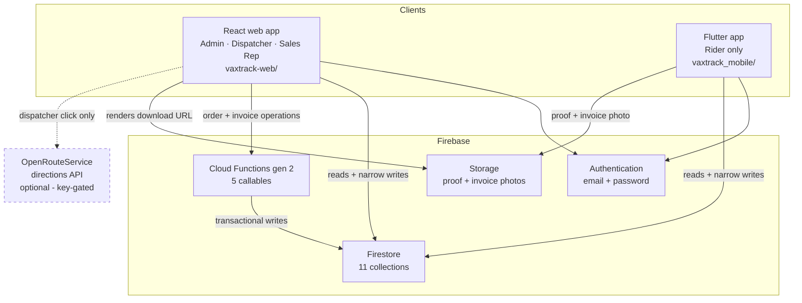
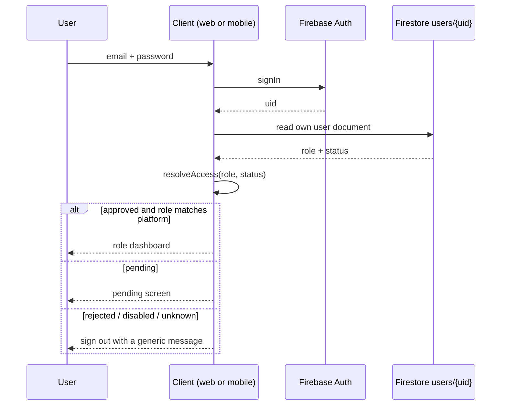
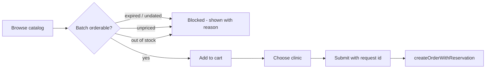
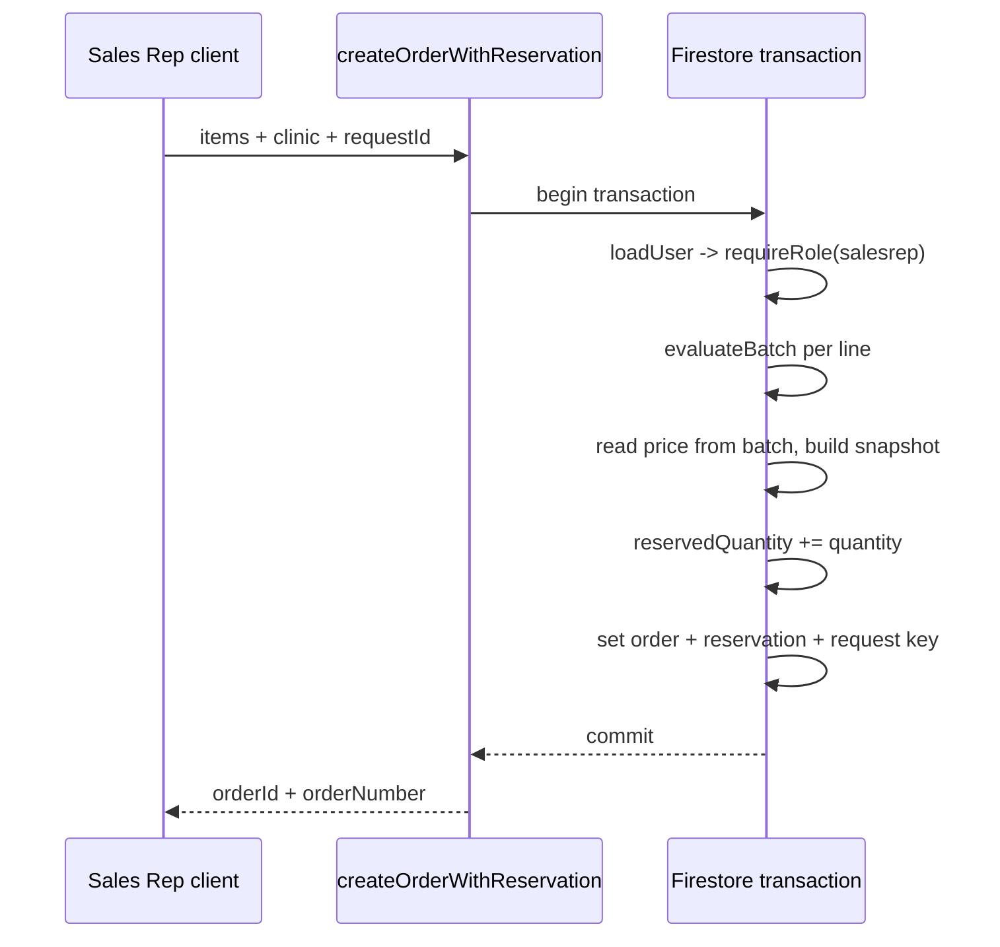
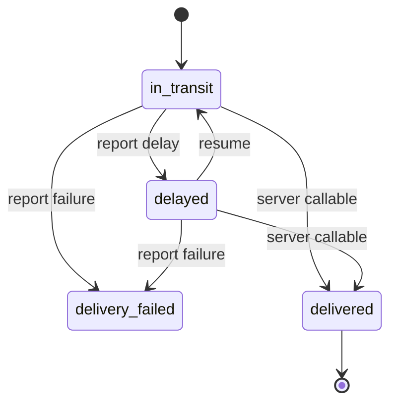

# VaxTrack System Handbook for 3MGS Pharma Inc.

## 1. Document control

| Field | Value |
|---|---|
| Document title | VaxTrack System Handbook for 3MGS Pharma Inc. |
| System name | VaxTrack |
| Client | 3MGS Pharma Inc. |
| Repository worktree inspected | `C:\VAXTRACK-web-ui` |
| Branch inspected | `feat/order-delivery-workflow` |
| Commit inspected | `72fba43` — *fix: derive inventory expiry status from current dates* |
| Working-tree state at inspection | **Not clean.** Four uncommitted Admin Deliveries changes were present: modified `vaxtrack-web/src/pages/admin/Deliveries.jsx`, `vaxtrack-web/src/pages/admin/Deliveries.css`, `vaxtrack-web/src/services/deliveryService.js`, plus untracked `vaxtrack-web/tests/deliveries.test.js`. Claims that depend on those files are marked **uncommitted** in this handbook. |
| Date generated | 2026-09-08 |
| Document status | **Draft / Living document** |

**Evidence-first disclaimer.** Every claim in this handbook was checked against executable source in this repository at the commit above. Where source and older documentation disagreed, source won — several `.md` files in `vaxtrack-web/docs/` and the project `CLAUDE.md` contain statements that are now stale, and this handbook does not repeat them. Nothing here describes planned functionality as implemented. Where a fact could not be established from source, it is marked *Verification pending* or *Uncertain* rather than guessed. No credentials, API keys, environment values, or test-account details appear in this document.

---

## 2. Executive overview

VaxTrack is a vaccine delivery and cold-chain **logistics record system** for 3MGS Pharma Inc. It tracks a vaccine order from the moment a Sales Representative places it, through dispatcher assignment and cargo loading, out to a rider carrying it to a clinic, and finally to proof of delivery and an invoice.

Its operational purpose is **traceability and stock integrity**: at any moment the business can say which batch of which vaccine is committed to which clinic order, who is carrying it, what stage it has reached, and what it was priced at when the order was agreed.

**Platforms**

- **Admin, Dispatcher, and Sales Representative** use the React web application (`vaxtrack-web/`).
- **Rider** uses the Flutter mobile application (`vaxtrack_mobile/`). Riders are blocked from the web portal by design.
- **Firebase** provides the backend confirmed by source: Authentication, Firestore, Cloud Functions (gen 2), and Storage.

**Current boundaries — what VaxTrack does NOT do.** The following are stated explicitly because they are commonly assumed:

| Not present | Evidence |
|---|---|
| SMS notifications | No SMS provider, gateway, or send call anywhere in the repository. |
| Push notifications | No Firebase Cloud Messaging registration or `getMessaging` call in web or Flutter source. |
| Email delivery | No mail transport, template, or send call. Firebase Auth's own password-reset email is the only email path (`vaxtrack-web/src/pages/ForgotPassword.jsx`). |
| AI or ML route optimization | No optimizer, no OR-Tools, no solver. |
| Automatic geofence **enforcement** | Deviation is *detected and recorded* on the rider device; nothing auto-changes an order's status from a geofence. |
| Cold-chain temperature sensing | No sensor integration and no temperature field written by any live path. `vaxtrack-web/src/pages/admin/AddStock.jsx` explicitly collects no storage temperature. |
| Driver rating | No rating field, collection, or UI. |
| Admin live rider map | Deliberately not implemented; blocked on a client decision (§14). |

---

## 3. Architecture overview



**Diagram notes**

- **OpenRouteService** is the only external provider confirmed in source (`vaxtrack-web/src/services/routeService.js`). It is **key-gated**: `isRouteServiceConfigured()` returns false when no key is present, and the Dispatcher Geofence page then shows an unavailable state instead of a route. It is called only on an explicit dispatcher button click — never automatically, never in a loop.
- **App Check is not enforced.** The callables authenticate the *user* but do not attest the *client* (§11).
- Firestore composite indexes are **not deployed** — `vaxtrack-web/firestore.indexes.json` contains empty `indexes` and `fieldOverrides`. Every current query is single-field.

---

## 4. Role and access matrix

| Role | Platform | Main responsibilities | Accessible modules | Permitted writes | Approval requirement | Explicit restrictions |
|---|---|---|---|---|---|---|
| **Admin** | React web | Catalog and stock, clinics, rider approval, monitoring, invoicing | All `/admin/*` routes | Vaccines, vaccine types, stock batches (create + re-price), clinics, user role/status, alerts (create/resolve/read), invoice drafts and issuance | `role: "admin"` **and** `status: "approved"` | Cannot change `quantity` or `reservedQuantity` on a batch from the client — those move only inside a callable transaction |
| **Sales Representative** | React web | Browse catalog, build a cart, place clinic orders, track own orders | `/sales-rep/*` | Creates orders **only** through the `createOrderWithReservation` callable | `role: "salesrep"` + `approved` | Cannot read other reps' orders; no invoice or counter access; cannot write an order document directly |
| **Dispatcher** | React web | Assign riders, run cargo loading, monitor shipments, generate a route | `/dispatcher/*` | Order assignment fields, loading metadata, status promotions within dispatcher authority, route fields, cancellation, failed-order recovery | `role: "dispatcher"` + `approved` | Cannot read the whole `users` collection — only `role == "rider"` documents; no invoice or counter access; cannot mark an order delivered |
| **Rider** | Flutter mobile | Carry assigned orders, report transit outcomes, upload proof | Mobile screens only | Status transitions from `in_transit`/`delayed`, own location fields, proof/invoice URLs, own route-deviation alert | `role: "rider"` + `approved` | **Blocked from the web portal**; cannot reassign, cancel, or self-approve; cannot write `delivered` directly (server callable only) |

Role and status normalization is centralized in `vaxtrack-web/src/services/authorization.js` (`resolveAccess`, `normalizeRole`, `normalizeStatus`), which **fails closed** — an unknown role or status denies access rather than defaulting. The web route guards are `AdminRoute`, `SalesRepRoute`, and `DispatcherRoute` in `vaxtrack-web/src/components/`. On mobile, `vaxtrack_mobile/lib/services/auth_service.dart` performs the equivalent check and signs out a non-approved or non-rider account.

### Unsupported: staff provisioning

**Status: Unsupported.** There is no in-application way to create an Admin, Dispatcher, or Sales Representative account. Self-registration in source creates **riders only** — `registerRider` in `vaxtrack_mobile/lib/services/auth_service.dart` writes `role: "rider"`, `status: "pending"`, and the Firestore rule for `users` create permits a self-registration only in that exact shape. Staff accounts must currently be created out-of-band (Firebase Console) and then have their role set by an Admin through Settings (`updateUserRole` in `vaxtrack-web/src/services/userService.js`). A supported provisioning method is an open client decision (§14).

---

## 5. High-level module catalog

| Epic ID | Module | Purpose | Primary actors | Main data source | Status |
|---|---|---|---|---|---|
| EPIC-01 | Identity, Authentication, and Role Access | Prove who a user is and what they may reach | All roles | `users` | Implemented and verified |
| EPIC-02 | Vaccine Catalog and Inventory | Define products and hold priced, dated stock batches | Admin, Sales Rep (read) | `vaccines`, `vaccineTypes`, `inventory` | Implemented and verified |
| EPIC-03 | Clinic Management | Maintain delivery destinations and optional coordinates | Admin, Sales Rep (read) | `clinics` | Implemented and verified |
| EPIC-04 | Sales Representative Ordering | Turn catalog stock into a submitted clinic order | Sales Rep | `inventory`, `clinics`, `orders` | Implemented and verified |
| EPIC-05 | Server Order and Stock Lifecycle | Reserve, release, and consume stock atomically | Server (callables) | `orders`, `inventory`, `inventoryReservations`, `orderRequestKeys` | Implemented and verified |
| EPIC-06 | Dispatcher Assignment and Cargo Loading | Give an order to a rider and confirm the cargo | Dispatcher | `orders`, `users` | Implemented and verified |
| EPIC-07 | Rider Mobile Delivery Execution | Carry and complete the delivery | Rider | `orders` | Implemented — runtime verification pending |
| EPIC-08 | Routing, Geofencing, and Location Tracking | Show where a rider is and the planned road route | Dispatcher, Rider | `orders`, `users` | Partial |
| EPIC-09 | Proof of Delivery and Failed-Delivery Recovery | Capture evidence; recover a stopped delivery | Rider, Dispatcher | Storage, `orders` | Partial |
| EPIC-10 | Alerts and Notifications | Record and resolve operational incidents | Rider (create), Admin, Dispatcher | `alerts` | Partial |
| EPIC-11 | Pricing, Invoicing, and Financial Integrity | Price an order immutably and issue an invoice | Admin, Server | `orders`, `invoices`, `counters` | Partial — blocked by client decision |
| EPIC-12 | Admin Monitoring, Deliveries, and Analytics | Give Admin an honest operational picture | Admin | `orders`, `inventory`, `alerts`, `users` | Implemented and verified |
| EPIC-13 | Firebase Security, Storage, and Platform Configuration | Enforce the security boundary | Platform | Rules, config | Partial |
| EPIC-14 | Migration, Deployment, Testing, and Documentation | Keep the system releasable and evidenced | Developers | Tooling | Partial |

---

## 6. Detailed module handbook

### EPIC-01 — Identity, Authentication, and Role Access

- **Purpose** — Authenticate a user, resolve their role and approval status, and route them to the surface they are entitled to.
- **Actors** — Admin, Dispatcher, Sales Representative, Rider.
- **Web routes** — `/login`, `/forgot-password`, `/pending`, `/pending-approval` (redirect). Guards wrap `/admin/*`, `/sales-rep/*`, `/dispatcher/*`.
- **Mobile screens** — `login_screen.dart`, `register_screen.dart`, `profile_screen.dart`.
- **Firestore collections** — `users`.
- **Services** — `src/services/authorization.js`, `src/services/userService.js`, `lib/services/auth_service.dart`, `lib/utils/rider_registration.dart`.
- **Security boundary** — Route guards are convenience only; the enforcing boundary is the `users` and per-collection Firestore rules, which re-read `role` and `status` server-side on every request.
- **Dependencies** — Firebase Authentication.
- **Current status** — Implemented and verified.
- **Known limitations** — Employee-ID login was removed for security and is not available; staff provisioning is unsupported (§4); legacy production `users` documents with corrupt role/status values are denied access by design (§14).

| Feature ID | Feature | User-facing function | System function | Actor | Evidence | Status |
|---|---|---|---|---|---|---|
| F-01.1 | Email + password sign-in | Sign in from the web portal | Authenticate, then read `users/{uid}` post-auth to resolve role | All web roles | `src/pages/Login.jsx`, `resolveLoginDestination` in `src/services/authorization.js` | Implemented and verified |
| F-01.2 | Fail-closed access resolution | Be sent to the correct dashboard, or blocked | Normalize role/status; deny on anything unrecognized | All | `resolveAccess` in `src/services/authorization.js`; `tests/authorization.test.js` | Implemented and verified |
| F-01.3 | Route guarding | Cannot open another role's pages | Redirect on wrong role, pending, rejected, or disabled | All web roles | `src/components/AdminRoute.jsx`, `SalesRepRoute.jsx`, `DispatcherRoute.jsx` | Implemented and verified |
| F-01.4 | Rider blocked from web | Clear message directing rider to the mobile app | Reject `role == "rider"` at the web login | Rider | `src/pages/Login.jsx` | Implemented and verified |
| F-01.5 | Rider self-registration | Apply for a rider account from the phone | Create Auth account, then `users/{uid}` with `role: "rider"`, `status: "pending"`; sign out | Rider | `registerRider` in `lib/services/auth_service.dart`; `users` create rule in `firestore.rules` | Implemented — runtime verification pending |
| F-01.6 | Password reset | Request a reset email | Delegate to Firebase Auth | All | `src/pages/ForgotPassword.jsx` | Implemented — runtime verification pending |
| F-01.7 | Own-profile maintenance | Edit own name, phone, organization | Whitelisted field update on `users/{uid}` | Sales Rep, Dispatcher | `updateUserProfile` in `src/services/userService.js` | Implemented and verified |
| F-01.8 | Staff account creation | — | — | — | No source | **Unsupported** |

---

### EPIC-02 — Vaccine Catalog and Inventory

- **Purpose** — Define vaccine products and hold the physical stock batches that orders draw from.
- **Actors** — Admin (write), Sales Representative (read), server (settlement writes).
- **Web routes** — `/admin/inventory`, `/admin/add-vaccine`, `/admin/add-stock`.
- **Firestore collections** — `vaccines`, `vaccineTypes`, `inventory`.
- **Services** — `src/services/vaccineService.js`, `src/services/inventoryService.js`, `src/services/expiry.js`, `src/services/money.js`.
- **Security boundary** — Catalog readable by any approved user; writes admin-only. `isValidNewStockBatch()` in `firestore.rules` validates a new batch's shape. **No client may change `quantity` or `reservedQuantity`** after creation.
- **Dependencies** — EPIC-01 for role, EPIC-11 for the price on each batch.
- **Current status** — Implemented and verified.
- **Known limitations** — The stored `inventory.status` field is stamped once at batch creation and never recomputed; the web now derives current expiry condition from `expiryDate` instead and ignores the stored field (§14, LIM-03).

| Feature ID | Feature | User-facing function | System function | Actor | Evidence | Status |
|---|---|---|---|---|---|---|
| F-02.1 | Register a vaccine | Add a product with SKU and type | Reject duplicate SKU; write to `vaccines` | Admin | `addVaccine`, `skuExists` in `src/services/vaccineService.js`; `tests/addVaccine.test.js` | Implemented and verified |
| F-02.2 | Manage vaccine types | Add a type used by the product form | Write to `vaccineTypes` | Admin | `addVaccineType`, `getVaccineTypes` | Implemented and verified |
| F-02.3 | Add a stock batch | Record arrival, expiry, quantity, and price | Reject duplicate batch id; require an integer centavo price > 0; initialise `reservedQuantity: 0` | Admin | `addStockBatch`, `batchIdExists`; `isValidNewStockBatch()` in `firestore.rules`; `tests/addStock.test.js`, `tests/addStockService.test.js` | Implemented and verified |
| F-02.4 | Live inventory list | See every batch with on-hand, reserved, available | Subscribe to `inventory`; derive available as `quantity − reservedQuantity` | Admin | `subscribeInventory` in `src/services/inventoryService.js`; `normalizeInventoryItem` in `src/pages/admin/Inventory.jsx` | Implemented and verified |
| F-02.5 | Current expiry condition | See Expired / within 30 / 31–90 / in date / no date | Derive from `expiryDate` against a Manila date-only cutoff; never trust the stored status | Admin, Sales Rep | `deriveExpiryCondition` in `src/services/expiry.js`; `tests/expiryStatus.test.js`, `tests/expiryRanges.test.js` | Implemented and verified |
| F-02.6 | Data-quality flags | See why a batch cannot be ordered | Flag text quantities, invalid reserved figures, missing price, expired, undated | Admin | `normalizeInventoryItem` in `src/pages/admin/Inventory.jsx` | Implemented and verified |
| F-02.7 | Re-price a batch | Set or edit the selling price | Whitelisted update writing price + server-stamped audit | Admin | `updateStockPrice` in `src/services/vaccineService.js`; `stockPriceAuditValid()` in `firestore.rules` | Implemented and verified |
| F-02.8 | Admin stock correction | — | — | — | No callable exists; rules refuse client `quantity` writes | **Planned** |

---

### EPIC-03 — Clinic Management

- **Purpose** — Maintain the delivery destinations an order can be placed against.
- **Actors** — Admin (write), Sales Representative (read).
- **Web routes** — `/admin/clinics`; `/admin/register-clinic` and `/admin/clinic-success` are registered but superseded by the inline modal on `/admin/clinics`.
- **Firestore collections** — `clinics`.
- **Services** — `src/services/clinicService.js`, `src/services/clinicLocation.js`, `src/services/orderLocation.js`.
- **Security boundary** — Read by any approved user; write admin-only.
- **Dependencies** — EPIC-08 consumes clinic coordinates when present.
- **Current status** — Implemented and verified.
- **Known limitations** — Coordinates are entered **manually**; there is no geocoding provider. Clinics without coordinates are fully usable for ordering but produce no destination marker or geofence.

| Feature ID | Feature | User-facing function | System function | Actor | Evidence | Status |
|---|---|---|---|---|---|---|
| F-03.1 | Register a clinic | Add a clinic with contact and address | Reject duplicate name; write to `clinics` | Admin | `addClinic`, `clinicNameExists` in `src/services/clinicService.js`; `tests/adminClinics.test.js` | Implemented and verified |
| F-03.2 | Clinic directory | Search, filter, page the clinic list | Subscribe to `clinics` | Admin | `subscribeClinics` | Implemented and verified |
| F-03.3 | Manual coordinates | Place a clinic on a map picker | Validate latitude/longitude ranges; **reject** an out-of-range radius rather than clamping | Admin | `validateClinicLocation` in `src/services/clinicLocation.js`; `src/pages/admin/ClinicLocationSection.jsx`; `tests/clinicLocation.test.js`, `tests/clinicLocationDialog.test.js` | Implemented and verified |
| F-03.4 | Coordinate snapshot on order | — (invisible) | Copy clinic coordinates onto the order at creation | Server | `buildClinicLocationSnapshot` in `src/services/orderLocation.js`; `tests/orderLocation.test.js` | Implemented and verified |
| F-03.5 | Clinic geocoding | — | — | — | No provider in source | **Not implemented** |

---

### EPIC-04 — Sales Representative Ordering

- **Purpose** — Let a Sales Representative turn available stock into a submitted clinic order.
- **Actors** — Sales Representative.
- **Web routes** — `/sales-rep`, `/sales-rep/inventory`, `/sales-rep/request-order`, `/sales-rep/place-order`, `/sales-rep/order-confirmation`, `/sales-rep/order-tracking`, `/sales-rep/alerts`, `/sales-rep/settings`.
- **Firestore collections** — reads `inventory`, `clinics`; orders created **through the server only**.
- **Services** — `src/services/inventoryCallables.js`, `src/services/expiry.js`, `src/services/clinicService.js`.
- **Security boundary** — The Sales Rep never writes an order document. `createOrderWithReservation` is the only path, and the `orders` create rule is admin-only for direct client writes.
- **Dependencies** — EPIC-02, EPIC-03, EPIC-05, EPIC-11.
- **Current status** — Implemented and verified.
- **Known limitations** — The cart is held in `localStorage` between the catalog and checkout pages; an abandoned cart is per-browser and not recoverable elsewhere.

| Feature ID | Feature | User-facing function | System function | Actor | Evidence | Status |
|---|---|---|---|---|---|---|
| F-04.1 | Browse orderable stock | See each batch with price, availability, and why it is blocked | Derive availability; block expired, undated, unpriced, and out-of-stock batches **before** checkout | Sales Rep | `normalizeProduct` in `src/pages/salesRep/SalesRepRequestOrder.jsx`; `availableStock` in `src/services/inventoryCallables.js` | Implemented and verified |
| F-04.2 | Catalog gate matches the server | Never build a cart the server will refuse | Client blocking reasons align 1:1 with the callable's refusal codes | Sales Rep | `deriveExpiryCondition` + `evaluateBatch`; `tests/expiryRanges.test.js` | Implemented and verified |
| F-04.3 | Build a cart | Add quantities per batch | Persist selection to `localStorage` between pages | Sales Rep | `src/pages/salesRep/SalesRepRequestOrder.jsx` | Implemented and verified |
| F-04.4 | Place an order | Choose a clinic, confirm, submit | Call `createOrderWithReservation` with an idempotency key | Sales Rep | `src/pages/salesRep/SalesRepPlaceOrder.jsx`; `newRequestId` in `src/services/inventoryCallables.js` | Implemented and verified |
| F-04.5 | Track own orders | Follow status of own orders only | Subscribe filtered by `createdByUid` | Sales Rep | `subscribeSalesRepOrders` in `src/services/orderService.js`; `orders` read rule | Implemented and verified |
| F-04.6 | Derived alerts view | See own orders needing attention | Derive alert-like rows from order status (does **not** read `alerts`) | Sales Rep | `src/pages/salesRep/SalesRepAlerts.jsx` | Implemented and verified |

---

### EPIC-05 — Server Order and Stock Lifecycle

- **Purpose** — Make order creation, cancellation, and completion atomic with the stock movements they imply.
- **Actors** — Server (Cloud Functions), triggered by Sales Rep, Dispatcher, and Rider actions.
- **Firestore collections** — `orders`, `inventory`, `inventoryReservations`, `orderRequestKeys`.
- **Services and Cloud Functions** — `functions/index.js` exports `createOrderWithReservation`, `cancelOrderWithInventoryRelease`, `markOrderDeliveredWithInventoryConsumption`. Logic in `functions/src/operations.js`; pure policy in `functions/src/policy.js`.
- **Security boundary** — `inventoryReservations` and `orderRequestKeys` are `allow read, write: if false` — **no client may read or write them at all**. Stock arithmetic exists only inside a server transaction.
- **Dependencies** — EPIC-01 (role), EPIC-02 (batches), EPIC-11 (price snapshot).
- **Current status** — Implemented and verified.
- **Known limitations** — There is no server function for an admin stock correction; a mis-keyed batch must be fixed in the console.

| Feature ID | Feature | User-facing function | System function | Actor | Evidence | Status |
|---|---|---|---|---|---|---|
| F-05.1 | Create order + reserve stock | Submit an order and see it appear | In one transaction: validate role, evaluate each batch, snapshot price, increment `reservedQuantity`, write the order and a reservation | Sales Rep → server | `createOrderWithReservation` in `functions/src/operations.js` | Implemented and verified |
| F-05.2 | Batch eligibility gate | Clear refusal message | Refuse on invalid quantity, invalid reserved figure, unusable status, expired/undated, unpriced, or changed price | Server | `evaluateBatch` in `functions/src/policy.js`; `functions/test/policy.test.js` | Implemented and verified |
| F-05.3 | Idempotent submission | A double-click does not double-order | Record a request key; replay returns the original result | Server | `validateRequestId`, `canonicalRequestFingerprint`; `orderRequestKeys` | Implemented and verified |
| F-05.4 | Cancel + release stock | Cancel an order and free the stock | Transaction: settle each batch back, mark reservation `released`, set `cancelled` | Dispatcher → server | `cancelOrderWithInventoryRelease`; `settleBatch(mode: "release")` | Implemented and verified |
| F-05.5 | Deliver + consume stock | Mark delivered and draw the stock down | Transaction: decrement `quantity` and `reservedQuantity`, mark reservation `consumed`, set `delivered` + `deliveredAt` | Rider → server | `markOrderDeliveredWithInventoryConsumption` | Implemented and verified |
| F-05.6 | Negative-stock protection | — | Refuse a settlement whose figures do not cover the order rather than driving a counter negative | Server | `settleBatch` in `functions/src/policy.js` | Implemented and verified |
| F-05.7 | Legacy unallocated orders | — | Orders predating reservations are marked `inventoryReconciliation: "legacy-unallocated"` and settle without stock movement | Server | `isLegacyOrder` in `functions/src/policy.js` | Implemented and verified |

---

### EPIC-06 — Dispatcher Assignment and Cargo Loading

- **Purpose** — Give a pending order to an approved rider and confirm the physical cargo before it leaves.
- **Actors** — Dispatcher.
- **Web routes** — `/dispatcher`, `/dispatcher/assign-rider`, `/dispatcher/shipments`, `/dispatcher/cargo-loading`, `/dispatcher/geofence`, `/dispatcher/settings`.
- **Firestore collections** — `orders`; reads `users` filtered to `role == "rider"`.
- **Services** — `src/services/orderService.js`, `src/services/cargoLoadingService.js`, `src/services/orderWorkflow.js`.
- **Security boundary** — `isValidRiderAssignment()`, `isValidLoadingPromotion()`, `isLoadingMetadataUpdate()`, `isValidDispatch()`, `isValidCancellation()`, and `isValidDispatcherOrderWrite()` in `firestore.rules` constrain exactly which fields and transitions a dispatcher may write. Status audit fields must be server-stamped (`request.time`).
- **Dependencies** — EPIC-01, EPIC-05.
- **Current status** — Implemented and verified.
- **Known limitations** — Cargo Loading lists only riders that are `role: "rider"` **and** `status: "approved"`; if a rider is disabled after assignment their orders disappear from that page and must be reassigned.

| Feature ID | Feature | User-facing function | System function | Actor | Evidence | Status |
|---|---|---|---|---|---|---|
| F-06.1 | Pending dispatch queue | See orders awaiting a rider | Subscribe filtered to `pending_dispatch` | Dispatcher | `subscribePendingDispatchOrders` in `src/services/orderService.js` | Implemented and verified |
| F-06.2 | Assign a rider | Pick an approved rider and confirm | Transactional assignment writing rider identity + audit; refuses if the order moved | Dispatcher | `assignRiderToOrder`; `tests/riderAssignment.test.js` | Implemented and verified |
| F-06.3 | Assignment race safety | Two dispatchers cannot both assign | Optimistic-concurrency transaction; the loser is rejected and writes nothing | Dispatcher | `tests/riderAssignment.test.js` | Implemented and verified |
| F-06.4 | Cargo loading checklist | Tick each order as loaded | Write `isLoaded` + audit; promote `assigned → loading` on first tick | Dispatcher | `updateOrderLoadedState` in `src/services/cargoLoadingService.js` | Implemented and verified |
| F-06.5 | No backwards status | Unticking does not undo the stage | Clear `isLoaded` but never regress `loading → assigned` | Dispatcher | `canUpdateLoadingMetadata` in `src/services/orderWorkflow.js` | Implemented and verified |
| F-06.6 | Finalize dispatch | Send a rider's whole group out | Batch `loading → in_transit` with `dispatchedAt`, `startedAt`, audit | Dispatcher | `finalizeRiderDispatch`; `isValidDispatch()` in `firestore.rules` | Implemented and verified |
| F-06.7 | Shipment monitoring | Watch active shipments; delay/cancel | Read-through subscription plus permitted transitions only | Dispatcher | `src/pages/dispatcher/DispatcherShipments.jsx`; `tests/dispatcherLifecycle.test.js` | Implemented and verified |
| F-06.8 | Cancel an order | Cancel with a reason | Server callable releases stock; reason length-validated | Dispatcher | `cancelOrderByDispatcher` in `src/services/orderService.js`; `validateReason` | Implemented and verified |

---

### EPIC-07 — Rider Mobile Delivery Execution

- **Purpose** — Let the rider see assigned work and record what happened to it.
- **Actors** — Rider.
- **Mobile screens** — `dashboard_screen.dart`, `deliveries_screen.dart`, `delivery_detail_screen.dart`, `route_monitoring_screen.dart`, `proof_screen.dart`, `profile_screen.dart`.
- **Firestore collections** — `orders` (own assignments only).
- **Services** — `lib/services/delivery_service.dart`, `lib/utils/order_workflow.dart`, `lib/utils/order_mapping.dart`, `lib/utils/sync_status.dart`.
- **Security boundary** — `isValidDelayReport()`, `isValidResume()`, `isValidFailureReport()` in `firestore.rules`; `delivered` is refused from any client and must go through the callable.
- **Dependencies** — EPIC-01, EPIC-05, EPIC-06.
- **Current status** — **Implemented — runtime verification pending.** The Flutter suite is substantial (19 test files) and covers the pure logic; end-to-end behaviour on a physical device is unverified (§12).
- **Known limitations** — Location tracking is foreground-only; background tracking is not implemented. A physical device has not been available for proof-upload verification.

| Feature ID | Feature | User-facing function | System function | Actor | Evidence | Status |
|---|---|---|---|---|---|---|
| F-07.1 | See assigned deliveries | List own active and completed work | Stream `orders` where `assignedRiderId == uid`, with per-document isolation so one bad record cannot break the list | Rider | `riderDeliveriesWithSync` in `lib/services/delivery_service.dart`; `lib/utils/order_mapping.dart`; `test/order_mapping_test.dart` | Implemented — runtime verification pending |
| F-07.2 | Offline/sync visibility | Know whether the list is live or cached | Derive a sync state from the snapshot metadata | Rider | `lib/utils/sync_status.dart`, `lib/widgets/sync_indicator.dart`; `test/sync_status_test.dart` | Implemented — runtime verification pending |
| F-07.3 | Report a delay | Record a delay with a reason | `in_transit → delayed` with `delayedAt == request.time` and a meaningful reason | Rider | `reportDelay`; `isValidDelayReport()` in `firestore.rules` | Implemented — runtime verification pending |
| F-07.4 | Resume transit | Return a delayed delivery to the road | `delayed → in_transit`, re-stamping `startedAt` | Rider | `resumeTransit`; `isValidResume()` | Implemented — runtime verification pending |
| F-07.5 | Report a failed delivery | Record that the delivery could not be completed | `in_transit`/`delayed → delivery_failed` with a reason; rider stops there | Rider | `reportDeliveryFailure`; `isValidFailureReport()`; `test/order_workflow_test.dart` | Implemented — runtime verification pending |
| F-07.6 | Mark delivered | Complete the delivery | Calls the server callable, which consumes stock in the same transaction | Rider → server | `markDelivered` in `lib/services/delivery_service.dart` | Implemented — runtime verification pending |
| F-07.7 | Transition guard on device | Cannot perform an illegal transition | Client-side `assertTransition` mirrors the shared workflow table | Rider | `lib/utils/order_workflow.dart`; `test/order_workflow_test.dart` | Implemented and verified (unit) |
| F-07.8 | Quantity parsing hardening | Malformed quantities do not crash the app | Defensive parsing in the delivery model | Rider | `test/delivery_quantity_test.dart` | Implemented and verified (unit) |

---

### EPIC-08 — Routing, Geofencing, and Location Tracking

- **Purpose** — Show where a rider is, draw the planned road route, and detect departure from it.
- **Actors** — Dispatcher (map + route), Rider (location + detection).
- **Web routes** — `/dispatcher/geofence`.
- **Mobile** — `lib/services/location_service.dart`, `lib/utils/deviation_detector.dart`, `route_monitor.dart`, `route_compliance_monitor.dart`, `screens/route_monitoring_screen.dart`, `screens/google_navigation_screen.dart`, `lib/utils/nav_availability.dart`.
- **Firestore collections** — `orders` (route + location fields), `users` (rider last location).
- **Services** — `src/services/routeService.js` (OpenRouteService), `saveOrderRoute` in `src/services/orderService.js`.
- **Security boundary** — Route fields are dispatcher-writable only, via `isRouteGenerationWrite()`; riders may write their own location fields on their own assigned orders.
- **Dependencies** — EPIC-03 (clinic coordinates), EPIC-06.
- **Current status** — **Partial.**
- **Known limitations** — Route generation requires clinic coordinates, which are entered manually; **no automatic geofence enforcement exists** — arrival is advisory and never auto-changes a status; background location tracking is not implemented; **Admin has no live rider map** (client decision, §14).

| Feature ID | Feature | User-facing function | System function | Actor | Evidence | Status |
|---|---|---|---|---|---|---|
| F-08.1 | Live rider position (Dispatcher) | See the rider's last known point on a map | Render a Leaflet marker from `lastLocation` | Dispatcher | `src/pages/dispatcher/DispatcherGeofence.jsx` | Implemented — runtime verification pending |
| F-08.2 | Stale-location badge | Know the position is old | Compare last update against a threshold and label it | Dispatcher | `DispatcherGeofence.jsx` | Implemented and verified |
| F-08.3 | Destination marker + radius circle | See the clinic and its radius | Draw from `clinicLat`/`clinicLng` when present | Dispatcher | `DispatcherGeofence.jsx` | Implemented — runtime verification pending |
| F-08.4 | Generate route and ETA | Click to fetch a road route | Call OpenRouteService, then persist six route fields | Dispatcher | `fetchRoute` in `src/services/routeService.js`; `saveOrderRoute` | Implemented — runtime verification pending |
| F-08.5 | Route unavailable state | Told plainly when routing is unconfigured | `isRouteServiceConfigured()` gates the button | Dispatcher | `src/services/routeService.js` | Implemented and verified |
| F-08.6 | Foreground location tracking | Position updates while the app is open on an in-transit order | Position stream with a distance filter and a minimum write interval | Rider | `startTracking` in `lib/services/location_service.dart` | Implemented — runtime verification pending |
| F-08.7 | Route deviation detection | Rider is told they left the route | Pure geometry against the decoded polyline, with hysteresis | Rider | `lib/utils/deviation_detector.dart`, `route_compliance_monitor.dart`; `test/deviation_detector_test.dart`, `test/route_compliance_monitor_test.dart` | Implemented and verified (unit) |
| F-08.8 | External navigation hand-off | Open the route in a maps app | Availability-checked launch | Rider | `lib/utils/nav_availability.dart`; `test/nav_availability_test.dart` | Implemented — runtime verification pending |
| F-08.9 | Automatic geofence enforcement | — | — | — | No auto-transition in source | **Not implemented** (advisory only, by decision) |
| F-08.10 | Background location tracking | — | — | — | No background service | **Not implemented** |
| F-08.11 | Admin live rider map | — | — | — | No source | **Blocked by client decision** |

---

### EPIC-09 — Proof of Delivery and Failed-Delivery Recovery

- **Purpose** — Capture evidence that a delivery happened, and give a stopped delivery a way back.
- **Actors** — Rider (capture), Dispatcher (recovery), Admin (view).
- **Mobile** — `proof_screen.dart`, `proof_submission_controller.dart`, `lib/services/proof_service.dart`, `lib/services/image_upload_service.dart`, `lib/utils/proof_validation.dart`.
- **Storage paths** — `proof_of_delivery/{orderId}/proof.jpg`, `invoices/{orderId}/invoice.jpg`.
- **Firestore collections** — `orders` (`proofOfDeliveryUrl`, `invoiceUrl`).
- **Security boundary** — `storage.rules` pins each evidence object to a **canonical filename** and permits write only by the rider currently assigned to that order (cross-checked against the Firestore order); read is limited to admin, dispatcher, the creating sales rep, and the assigned rider.
- **Dependencies** — EPIC-06, EPIC-07.
- **Current status** — **Partial** — rules and client code implemented and unit/emulator-tested; capture on a physical device is unverified.
- **Known limitations** — Physical-device validation of the camera→Storage path has not been performed (§14).

| Feature ID | Feature | User-facing function | System function | Actor | Evidence | Status |
|---|---|---|---|---|---|---|
| F-09.1 | Capture proof photo | Take or pick a delivery photo | Validate, upload to the canonical Storage path, write the download URL to the order | Rider | `uploadProof` in `lib/services/image_upload_service.dart`; `saveProofOfDelivery` in `lib/services/proof_service.dart`; `test/proof_service_test.dart` | Implemented — runtime verification pending |
| F-09.2 | Capture invoice photo | Photograph the paper invoice | Same path with the canonical invoice filename | Rider | `uploadInvoice`; `saveInvoicePhoto` | Implemented — runtime verification pending |
| F-09.3 | Submission validation | Cannot submit an incomplete proof | Pure validation before any upload | Rider | `lib/utils/proof_validation.dart`; `test/proof_validation_test.dart`, `test/proof_submission_controller_test.dart` | Implemented and verified (unit) |
| F-09.4 | Canonical filename pinning | — | Storage refuses any object name other than `proof.jpg` / `invoice.jpg`, so evidence cannot be shadowed by a second upload | Platform | `canonicalProofFile()`, `canonicalInvoiceFile()` in `storage.rules`; `tests/storage.rules.test.js` | Implemented and verified |
| F-09.5 | Assigned-rider-only write | — | Storage cross-reads the Firestore order to confirm the uploader is the assigned rider | Platform | `storage.rules` | Implemented and verified |
| F-09.6 | Admin proof display | See the proof image and invoice photo | Render the stored HTTPS download URL directly | Admin | `src/pages/admin/Deliveries.jsx` | Implemented and verified |
| F-09.7 | Failed-delivery recovery | Send a failed delivery back out | `delivery_failed → assigned` through a deliberately separate entry point, re-entering via Cargo Loading | Dispatcher | `reassignFailedOrder` in `src/services/orderService.js`; `isValidFailedOrderRecovery()` in `firestore.rules`; `tests/failedDeliveryRecovery.test.js` | Implemented and verified |
| F-09.8 | Physical-device proof run | — | — | — | No device available | **Blocked by environment** |

---

### EPIC-10 — Alerts and Notifications

- **Purpose** — Record operational incidents and let Admin work through them.
- **Actors** — Rider (creates route-deviation incidents), Admin and Dispatcher (read), Admin (resolve / mark read).
- **Web routes** — `/admin/alerts`.
- **Firestore collections** — `alerts`.
- **Services** — `src/services/alertService.js` (read/resolve/mark-read only), `lib/services/route_deviation_alert_service.dart` (the only creator besides Admin).
- **Security boundary** — The `alerts` rules are unusually detailed: a rider may create **only** a `route_deviation` incident, for an order they are currently assigned to, in an exact shape (critical, active, unread, server-stamped timestamps), and may later only refresh, reopen, or resolve **their own** incident with `resolutionReason == 'returned_to_route'`. `type`, `orderId`, `riderId`, and `firstCreatedAt` are immutable.
- **Dependencies** — EPIC-08.
- **Current status** — **Partial.**
- **Known limitations** — "Notifications" means **in-app records only**. There is no push, SMS, or email channel; the Admin Alerts page states this in a read-only channel list. Route deviation is the only incident type any automated path creates — expiry and stock alerts are not generated by any writer.

| Feature ID | Feature | User-facing function | System function | Actor | Evidence | Status |
|---|---|---|---|---|---|---|
| F-10.1 | Deviation incident creation | An incident appears when a rider leaves the route | Deterministic per-order/per-rider document upserted inside a transaction (idempotent) | Rider | `recordDeviation` in `lib/services/route_deviation_alert_service.dart`; `test/route_deviation_alert_service_test.dart` | Implemented — runtime verification pending |
| F-10.2 | Return-to-route resolution | The incident closes when the rider returns | `recordReturn` sets `resolved` with `resolutionReason: 'returned_to_route'` | Rider | `recordReturn`; `alerts` update rule | Implemented — runtime verification pending |
| F-10.3 | Alert centre | Review, filter, and open incidents | Subscribe to `alerts` | Admin | `subscribeAllAlerts` in `src/services/alertService.js` | Implemented and verified |
| F-10.4 | Resolve / mark read | Close or acknowledge an incident | `resolveAlert`, `markAlertRead` | Admin | `src/services/alertService.js` | Implemented and verified |
| F-10.5 | Delivery channel list | See which channels exist | Read-only list stating in-app is the only configured channel | Admin | `AlertChannelsModal` in `src/pages/admin/Alerts.jsx`; `tests/noOpControls.test.js` | Implemented and verified |
| F-10.6 | Push / SMS / email delivery | — | — | — | No provider in source | **Not implemented** |
| F-10.7 | Stock and expiry alerts | — | — | — | No writer creates these types | **Planned** |

---

### EPIC-11 — Pricing, Invoicing, and Financial Integrity

- **Purpose** — Attach a defensible price to an order and produce an invoice from it.
- **Actors** — Admin, server.
- **Web routes** — `/admin/invoices`, `/admin/invoices/:orderId`.
- **Firestore collections** — `orders` (price snapshot), `invoices`, `counters`.
- **Services and Cloud Functions** — `functions/index.js` exports `saveInvoiceDraftForPricedOrder` and `issueInvoiceForPricedOrder`; logic in `functions/src/invoiceOperations.js` and `functions/src/invoicePricing.js`; web helpers `src/services/money.js`, `src/services/invoiceModel.js`, `src/services/invoiceCallables.js`, `src/services/invoiceService.js`.
- **Security boundary** — `invoices` and `counters` are **admin-only**; Sales Rep and Dispatcher have no access at all. Money is handled exclusively as **integer centavos** — `parsePesosToCentavos` parses decimal digits as text to avoid float error.
- **Dependencies** — EPIC-02 (batch price), EPIC-05 (snapshot written at reservation).
- **Current status** — **Partial — blocked by client decision.** The mechanism is implemented and tested end to end; the actual selling prices are not supplied (§14).
- **Known limitations** — Three staging batches remain unpriced and are therefore unorderable by design; discount policy is undecided.

| Feature ID | Feature | User-facing function | System function | Actor | Evidence | Status |
|---|---|---|---|---|---|---|
| F-11.1 | Batch-owned selling price | Set a VAT-exclusive price per vial on a batch | Store `sellingPriceCentavos` as an integer > 0 with `priceCurrency: "PHP"` and `priceIsVatInclusive: false` | Admin | `addStockBatch`, `updateStockPrice`; `functions/src/policy.js` | Implemented and verified |
| F-11.2 | Server-authoritative pricing | The rep is never asked for a price | The callable reads the price from the batch inside the reservation transaction; the client supplies none | Server | `createOrderWithReservation`; `functions/index.js` header | Implemented and verified |
| F-11.3 | Immutable order snapshot | The agreed price cannot drift | Write `pricingVersion`, `priceCurrency`, `priceIsVatInclusive`, `subtotalCentavos`, `pricedAt` onto the order and never recompute | Server | `functions/src/operations.js`; `tests/invoiceContract.test.js` | Implemented and verified |
| F-11.4 | Price-change detection | A cart quoted at an old price is refused | Compare expected unit price against the batch; refuse in **both** directions with `price-changed` | Server | `validateExpectedPriceCentavos` in `functions/src/policy.js` | Implemented and verified |
| F-11.5 | Unpriced batch is unorderable | A batch with no price cannot be ordered | Refuse with `batch-unpriced` rather than quoting ₱0.00 | Server | `readSellingPriceCentavos`; `evaluateBatch` | Implemented and verified |
| F-11.6 | Invoice draft | Prepare an invoice for a priced order | Server callable builds the draft from the order's own snapshot | Admin | `saveInvoiceDraftForPricedOrder`; `functions/src/invoiceOperations.js` | Implemented and verified |
| F-11.7 | Issue an invoice | Lock and number an invoice | Transactional sequential numbering from `counters/invoice_{year}`; issued invoices become read-only | Admin | `issueInvoiceForPricedOrder`; `functions/test/integration/invoiceOperations.test.js` | Implemented and verified |
| F-11.8 | One invoice per order | Cannot double-invoice | Invoice document id **is** the order id | Admin | `functions/src/invoiceOperations.js`; `tests/invoiceModel.test.js` | Implemented and verified |
| F-11.9 | VAT presentation | Invoice shows the VAT treatment | 12% standard rate with `vatable` / `vat_exempt` / `zero_rated` classifications | Admin | `VAT_STANDARD_RATE`, `VAT_CLASSIFICATIONS` in `src/services/invoiceModel.js` | Implemented and verified |
| F-11.10 | Actual selling prices | — | — | — | Not supplied | **Blocked by client decision** |
| F-11.11 | Discount policy | — | — | — | Not decided | **Blocked by client decision** |

---

### EPIC-12 — Admin Monitoring, Deliveries, and Analytics

- **Purpose** — Give Admin an accurate operational picture without inventing figures.
- **Actors** — Admin.
- **Web routes** — `/admin`, `/admin/deliveries`, `/admin/analytics`, `/admin/riders`, `/admin/settings`.
- **Firestore collections** — `orders`, `inventory`, `alerts`, `users`.
- **Services** — `src/services/deliveryService.js`, `src/services/riderService.js`, `src/services/userService.js`.
- **Security boundary** — Read-only. These pages perform **no writes** except rider status and user role/status changes on the Riders and Settings pages.
- **Dependencies** — EPIC-02, EPIC-05, EPIC-10.
- **Current status** — Implemented and verified. *(Admin Deliveries corrections are **uncommitted** at the inspected commit — see Document control.)*
- **Known limitations** — Region distribution was removed because no live path writes `order.region`; hub performance is unavailable because no hub data source exists; no on-time rate is possible because orders carry no promised deadline.

| Feature ID | Feature | User-facing function | System function | Actor | Evidence | Status |
|---|---|---|---|---|---|---|
| F-12.1 | Operational KPIs | Total orders, delayed/cancelled, expiring stock, registered riders | Derive from four live subscriptions | Admin | `src/pages/admin/AdminDashboard.jsx`; `tests/adminDashboard.test.js` | Implemented and verified |
| F-12.2 | Status breakdown | Counts per canonical status | Derive rows from `ORDER_STATUSES` so no status can be silently dropped | Admin | `src/pages/admin/AdminDashboard.jsx` | Implemented and verified |
| F-12.3 | Deliveries register | Filter and inspect every order | Per-canonical-status filter and counts; neutral **Unknown** state for unrecognized values | Admin | `src/pages/admin/Deliveries.jsx`, `src/services/deliveryService.js`; `tests/deliveries.test.js` | Implemented and verified *(uncommitted)* |
| F-12.4 | Delivery detail drawer | See clinic, rider, activity, and proof | Read-only pass-through; timestamps labelled by the field they come from | Admin | `src/pages/admin/Deliveries.jsx` | Implemented and verified *(uncommitted)* |
| F-12.5 | Order volume + activity | Volume by period, activity by day and period | Bucket `createdAt`; shading stated as relative | Admin | `src/pages/admin/Analytics.jsx`; `tests/analytics.test.js` | Implemented and verified |
| F-12.6 | Average latest transit segment | Average time of the final transit leg | `startedAt → deliveredAt`; labelled as a segment because `startedAt` is re-stamped on resume | Admin | `src/pages/admin/Analytics.jsx` | Implemented and verified |
| F-12.7 | Rider administration | Approve, reject, or disable a rider | `updateRiderStatus` on `users/{uid}` | Admin | `src/services/riderService.js`; `tests/adminRiders.test.js` | Implemented and verified |
| F-12.8 | User management | Change a user's role or status | `updateUserRole`, `updateUserStatus` | Admin | `src/services/userService.js`; `tests/adminSettings.test.js` | Implemented and verified |
| F-12.9 | Region distribution | — | — | — | No live writer for `order.region` | **Removed** |
| F-12.10 | Hub performance ranking | — | — | — | No hub collection or per-order hub | **Not implemented** (honest empty state shown) |
| F-12.11 | On-time rate | — | — | — | No promised/scheduled deadline on an order | **Not implemented** (completion rate shown instead) |

---

### EPIC-13 — Firebase Security, Storage, and Platform Configuration

- **Purpose** — Enforce who may read and write what, independently of the client.
- **Actors** — Platform.
- **Artifacts** — `vaxtrack-web/firestore.rules`, `vaxtrack-web/storage.rules`, `vaxtrack-web/firebase.json`, `vaxtrack-web/.firebaserc` (aliases `default` and `staging`), `vaxtrack-web/firestore.indexes.json`.
- **Current status** — **Partial.**
- **Known limitations** — App Check is **not enforced**; composite indexes are not deployed (not currently needed); production data hygiene is outstanding (§14).

| Feature ID | Feature | User-facing function | System function | Actor | Evidence | Status |
|---|---|---|---|---|---|---|
| F-13.1 | Deny-by-default rules | — | Every collection requires an explicit allow | Platform | `firestore.rules` | Implemented and verified |
| F-13.2 | Role + approval helpers | — | `isAdmin()`, `isDispatcher()`, `isSalesRep()`, `isRider()` all require `status == "approved"` | Platform | `firestore.rules` | Implemented and verified |
| F-13.3 | Field-level order allowlists | — | Dispatcher and rider writes are limited to named field sets and named transitions | Platform | `isValidDispatcherOrderWrite()` and siblings | Implemented and verified |
| F-13.4 | Server-stamped audit | — | Status timestamps must equal `request.time`, so a client clock is never evidence | Platform | `statusAuditIsServerStamped()` | Implemented and verified |
| F-13.5 | Sealed server collections | — | `inventoryReservations` and `orderRequestKeys` deny all client access | Platform | `firestore.rules` | Implemented and verified |
| F-13.6 | Storage evidence rules | — | Canonical filenames; assigned-rider write; role-scoped read | Platform | `storage.rules`; `tests/storage.rules.test.js` | Implemented and verified |
| F-13.7 | Environment-based config | — | Firebase config read from `import.meta.env` with a fail-fast guard naming missing keys | Platform | `src/firebase.js` | Implemented and verified |
| F-13.8 | App Check enforcement | — | — | — | `enforceAppCheck` deliberately off; documented in `functions/index.js` | **Not configured** |

---

### EPIC-14 — Migration, Deployment, Testing, and Documentation

- **Purpose** — Keep the system releasable, evidenced, and understandable.
- **Actors** — Developers.
- **Artifacts** — `functions/scripts/previewMigration.mjs`, `functions/src/migrationPreview.js`, the test suites in §13, and `vaxtrack-web/docs/`.
- **Current status** — **Partial.**
- **Known limitations** — Several older documents in `vaxtrack-web/docs/` and `CLAUDE.md` are stale relative to source; `functions`' own `npm test` script uses `node --test test/`, which fails to resolve on the Node version in this environment (§13).

| Feature ID | Feature | User-facing function | System function | Actor | Evidence | Status |
|---|---|---|---|---|---|---|
| F-14.1 | Migration preview | Inspect what a migration would change | Read-only preview; writes nothing | Developer | `functions/scripts/previewMigration.mjs`; `functions/test/migrationPreview.test.js` | Implemented and verified |
| F-14.2 | Contract test suites | — | Node test suites over the real service modules via an in-memory Firestore stand-in | Developer | `tests/serviceHarness.js` and 30 suites | Implemented and verified |
| F-14.3 | Rules test suites | — | Emulator-backed Firestore and Storage rules tests | Developer | `tests/firestore.rules.test.js`, `tests/storage.rules.test.js` | Implemented and verified |
| F-14.4 | Environment separation | — | `default` and `staging` aliases; `.env.staging`; `build:staging` script | Developer | `.firebaserc`, `package.json` | Implemented and verified |
| F-14.5 | Documentation refresh | — | — | — | Older docs stale | **In progress** (this handbook) |

---

## 7. Workflow handbook

### 7.1 Authentication and role authorization



| Aspect | Detail |
|---|---|
| Starting condition | Unauthenticated visitor |
| Actor | Any user |
| Main steps | Sign in → read own `users/{uid}` **after** auth → normalize role/status → route or deny |
| Status transitions | None (account status is read, not written) |
| Documents affected | None written |
| Authority boundary | Client routing is convenience; Firestore rules re-check role and status on every request |
| Failure outcomes | Generic `Invalid email or password.` so the form cannot probe which emails exist; unknown role or status **denies** (fail-closed) |

### 7.2 Rider approval lifecycle

| Aspect | Detail |
|---|---|
| Starting condition | Rider submits the mobile registration form |
| Actor | Rider, then Admin |
| Main steps | `registerRider` creates the Auth account → writes `users/{uid}` with `role: "rider"`, `status: "pending"` → signs out → Admin approves or rejects on `/admin/riders` |
| Status transitions | `pending` → `approved` \| `rejected`; `approved` → `disabled`; `disabled` → `approved` |
| Documents affected | `users/{uid}` |
| Authority boundary | A rider may create only their own pending rider document; `isValidRiderLifecycleWrite()` prevents self-approval and self-role-change |
| Failure outcomes | If the Firestore write fails, the Auth account is deleted so the email stays reusable |

### 7.3 Inventory batch creation and pricing

| Aspect | Detail |
|---|---|
| Starting condition | Admin has a registered vaccine and physical stock to record |
| Actor | Admin |
| Main steps | Add Stock form → validate batch id uniqueness, dates, quantity, price → `addStockBatch` writes the batch with `reservedQuantity: 0` |
| Status transitions | None (batch condition is derived, not stored) |
| Documents affected | `inventory/{auto-id}` |
| Authority boundary | Client creates the batch, but `isValidNewStockBatch()` validates the shape and no client may later change `quantity`/`reservedQuantity` |
| Failure outcomes | Duplicate batch id, non-integer price, or price ≤ 0 all refuse before the write |

### 7.4 Sales Representative order creation



| Aspect | Detail |
|---|---|
| Starting condition | Approved Sales Rep, priced and in-date stock |
| Actor | Sales Representative |
| Main steps | Browse → cart → clinic → submit with an idempotency key |
| Status transitions | Order is created at `pending_dispatch` |
| Documents affected | `orders/{auto-id}`, `inventory/*`, `inventoryReservations/{orderId}`, `orderRequestKeys/{keyId}` |
| Authority boundary | **Entirely server-side.** The rep writes nothing directly |
| Failure outcomes | `batch-expired`, `batch-unpriced`, `batch-unavailable`, `price-changed`, `invalid-payload`, insufficient stock |

### 7.5 Server-side stock reservation



| Aspect | Detail |
|---|---|
| Starting condition | A validated create payload |
| Actor | Server |
| Main steps | Role check → per-batch evaluation → price snapshot → reserve → write order, reservation, request key |
| Status transitions | none → `pending_dispatch`; reservation → `reserved` |
| Documents affected | `orders`, `inventory`, `inventoryReservations`, `orderRequestKeys` |
| Authority boundary | Fully server-authoritative; the two support collections are unreadable by any client |
| Failure outcomes | Any refusal aborts the whole transaction — no partial reservation is possible |

### 7.6 Dispatcher assignment and cargo loading

| Aspect | Detail |
|---|---|
| Starting condition | Order at `pending_dispatch`; at least one approved rider |
| Actor | Dispatcher |
| Main steps | Assign rider → tick each order loaded → finalize dispatch for the rider's group |
| Status transitions | `pending_dispatch → assigned` → `loading` → `in_transit` |
| Documents affected | `orders/{id}` (assignment, loading, dispatch fields) |
| Authority boundary | Client writes, constrained by field-level rules and server-stamped timestamps |
| Failure outcomes | Concurrent assignment rejected; an order that moved on is refused; unticking never regresses the status |

### 7.7 Rider transit and delivery



| Aspect | Detail |
|---|---|
| Starting condition | Order at `in_transit` assigned to this rider |
| Actor | Rider |
| Main steps | Carry → optionally report a delay and resume → complete or report failure |
| Status transitions | See diagram |
| Documents affected | `orders/{id}`; on delivery also `inventory` and `inventoryReservations` |
| Authority boundary | Delay, resume, and failure are **client** writes under strict rules; **`delivered` is server-only** and refused from any client |
| Failure outcomes | An illegal transition is refused both on-device and by rules; a delay or failure without a meaningful reason is refused |

### 7.8 Failed-delivery recovery

| Aspect | Detail |
|---|---|
| Starting condition | Order at `delivery_failed` |
| Actor | Dispatcher |
| Main steps | Choose an approved rider → `reassignFailedOrder` → order re-enters Cargo Loading |
| Status transitions | `delivery_failed → assigned` (never straight back to `in_transit`) |
| Documents affected | `orders/{id}` |
| Authority boundary | A deliberately **separate** entry point from normal assignment, so neither function has two meanings |
| Failure outcomes | Refused if the order is not currently `delivery_failed`; the rider cannot perform this themselves |

### 7.9 Proof-of-delivery upload

| Aspect | Detail |
|---|---|
| Starting condition | Rider is on an assigned order and has captured an image |
| Actor | Rider |
| Main steps | Validate → upload to `proof_of_delivery/{orderId}/proof.jpg` → write `proofOfDeliveryUrl` onto the order |
| Status transitions | None directly |
| Documents affected | Storage object; `orders/{id}` |
| Authority boundary | Storage rules cross-read the order to confirm the uploader is the **currently assigned** rider; the filename is pinned |
| Failure outcomes | Wrong filename, wrong rider, or oversized/incorrect content type is refused by rules |

### 7.10 Invoice draft and issuance

| Aspect | Detail |
|---|---|
| Starting condition | An order carrying `pricingVersion: 1` |
| Actor | Admin |
| Main steps | Open the invoice editor → save draft → mark as issued |
| Status transitions | Invoice draft → issued (issued is read-only) |
| Documents affected | `invoices/{orderId}`, `counters/invoice_{year}` |
| Authority boundary | Both operations are **server callables**; `invoices` and `counters` are admin-only in rules |
| Failure outcomes | An order without a valid price snapshot is refused; a second invoice for the same order is impossible because the document id is the order id |

### 7.11 Alert creation and resolution

| Aspect | Detail |
|---|---|
| Starting condition | A rider on a routed order departs the polyline beyond the threshold |
| Actor | Rider (create), Admin (resolve) |
| Main steps | Detector confirms deviation → deterministic incident upserted → Admin reviews → rider return auto-resolves, or Admin resolves |
| Status transitions | Alert `active` → `resolved` |
| Documents affected | `alerts/{deterministic-id}` |
| Authority boundary | Rider may write only their own `route_deviation` incident in an exact shape with server-stamped times; Admin may create and resolve any alert |
| Failure outcomes | A rider cannot back-date, re-type, re-own, or arbitrarily re-status an incident |

---

## 8. Status lifecycle reference

Source of truth: `vaxtrack-web/src/services/orderWorkflow.js` (`ORDER_STATUSES`, `STATUS_LABELS`, `DISPATCHER_TRANSITIONS`, `RIDER_TRANSITIONS`), mirrored on mobile in `vaxtrack_mobile/lib/utils/order_workflow.dart` and on the server in `functions/src/policy.js`.

| Status key | Display label | Meaning | Allowed predecessor | Allowed next | Writer | Timestamp written | Recovery behaviour |
|---|---|---|---|---|---|---|---|
| `pending_dispatch` | Pending Dispatch | Created and awaiting a rider | — (creation) | `assigned`, `cancelled` | Server (`createOrderWithReservation`) | `createdAt` | — |
| `assigned` | Assigned | Given to a rider, not yet loaded | `pending_dispatch`, `delivery_failed` | `loading`, `cancelled` | Dispatcher | `assignedAt` | Entry point for failed-order recovery |
| `loading` | Loading | Cargo confirmed, preparing to leave | `assigned` | `in_transit`, `cancelled` | Dispatcher | `loadedAt`, `statusUpdatedAt` | Never regresses to `assigned` |
| `in_transit` | In Transit | On the road | `loading`, `delayed` | `delayed`, `delivered`, `delivery_failed`, `cancelled` | Dispatcher (dispatch) / Rider (resume) | `dispatchedAt`, `startedAt` | `startedAt` is **re-stamped** on every resume |
| `delayed` | Delayed | Stopped but recoverable | `in_transit` | `in_transit`, `delivered`, `delivery_failed`, `cancelled` | Rider | `delayedAt` | Rider may resume |
| `delivery_failed` | Delivery Failed | Rider stopped; needs a dispatcher | `in_transit`, `delayed` | `assigned`, `cancelled` | Rider | `deliveryFailedAt` | Dispatcher-only recovery to `assigned` |
| `delivered` | Delivered | Completed; stock consumed | `in_transit`, `delayed` | — (terminal) | **Server callable only** | `deliveredAt` | None — terminal |
| `cancelled` | Cancelled | Closed deliberately; stock released | any non-terminal | — (terminal) | Server callable (dispatcher-initiated) | `cancelledAt` | None — terminal |

**Terminal statuses:** `delivered`, `cancelled` (`TERMINAL_STATUSES`).
**Awaiting-dispatcher status:** `delivery_failed` (`AWAITING_DISPATCHER_STATUSES`) — deliberately kept out of the terminal set so summaries can say "needs attention" rather than "finished".

### Legacy aliases (read-only)

| Stored value | Displays as | Note |
|---|---|---|
| `completed` | Delivered | Appears on historical documents. `orderWorkflow` refuses to write it. |
| `canceled` (one *l*) | Cancelled | Same. Stored values are never rewritten. |

### Unrecognized statuses

A status value that is neither canonical nor a listed alias resolves to **Unknown** — it is **never** shown as Pending, Delayed, or any other real state. A document with **no** status field is also Unknown, not Pending. Admin Deliveries surfaces a banner when any such document exists and offers an `unknown` filter. *(Evidence: `resolveStatusKey`, `UNKNOWN_STATUS_KEY` in `src/services/deliveryService.js`; `tests/deliveries.test.js` — **uncommitted** at the inspected commit.)*

### Rider account lifecycle

| Status | Meaning | Set by | Consequence |
|---|---|---|---|
| `pending` | Registration submitted, awaiting review | Rider self-registration | Cannot sign in to the app; sees a pending message |
| `pending_approval` | Legacy synonym of `pending` | Legacy documents | Treated as pending |
| `approved` | Active rider | Admin | Full mobile access; appears in Assign Rider and Cargo Loading |
| `disabled` | Temporarily off duty | Admin | Access removed; assigned orders vanish from Cargo Loading until reassigned |
| `rejected` | Application refused | Admin | Access denied |

---

## 9. Firestore data dictionary

Eleven collections are proven by source. Fields listed are those referenced by executable code; this is not an exhaustive dump and **no field has been invented**.

### `users`
| Property | Detail |
|---|---|
| Document ID authority | Firebase Auth UID |
| Owning module | EPIC-01 |
| Important fields | `role`, `status`, `email`, `fullName`/`name`, `phone`/`contactNumber`, `employeeId` (optional), `vehiclePlate` (rider, optional), `organization` (optional), `lastLocation`, `lastLocationUpdate`, `locationAccuracy`, `heading`, `speed` |
| Field writer | Rider self-registration (`role`,`status` at create only); Admin (`role`,`status`); user (own profile whitelist); rider device (location fields) |
| Field readers | Self at **any** status (so login and guards can detect pending/disabled/rejected); Admin (all); Dispatcher (**only** `role == "rider"` documents, on both `get` and `list`) |
| Mutability | `role`/`status` admin-only after creation; a user can never change their own role or status. Rider self-registration additionally **pins the vehicle type to motorcycle**, because the company operates motorcycles only |
| Security rules | `match /users/{uid}`, `isValidRiderLifecycleWrite()`, `isKnownRole()`, `isKnownStatus()` |
| Legacy/optional | `employeeId` retained but employee-ID login was **removed**; legacy documents with `role: "pending"`/`"staff"` exist in production and are denied access |

### `vaccines` / `vaccineTypes`
| Property | Detail |
|---|---|
| Document ID authority | Firestore auto-ID |
| Owning module | EPIC-02 |
| Important fields | `vaccines`: `vaccineName`, `internalSku`, `vaccineType`, `manufacturer`. `vaccineTypes`: type name |
| Field writer | Admin |
| Field readers | Any approved user |
| Mutability | Mutable by admin |
| Security rules | `match /vaccines/{id}`, `match /vaccineTypes/{id}` — approved read, admin write |

### `inventory`
| Property | Detail |
|---|---|
| Document ID authority | Firestore auto-ID. **Mappers spread data first and assign `id` last**, so a stored field named `id` can never shadow the real identity |
| Owning module | EPIC-02 |
| Important fields | `vaccineId`, `vaccineName`, `vaccineType`, `manufacturer`, `internalSku`, `batchId`, `arrivalDate`, `expiryDate` (`YYYY-MM-DD`), `quantity`, `reservedQuantity`, `sellingPriceCentavos`, `priceCurrency`, `priceIsVatInclusive`, `status`, `createdAt`, `priceSetAt`, `priceSetByUid` |
| Field writer | Admin (create + re-price); **server transaction only** for `quantity`/`reservedQuantity` |
| Field readers | Any approved user |
| Mutability | `quantity`/`reservedQuantity` immutable from any client; price forward-only with server-stamped audit |
| Security rules | `match /inventory/{id}`, `isValidNewStockBatch()`, `stockPriceAuditValid()` |
| Legacy/optional | **`status` is stale by design** — stamped once at creation from the expiry date and never recomputed; the web now derives expiry condition from `expiryDate` and ignores it. Some hand-seeded staging batches store `quantity` as text and are flagged as needing migration |

### `clinics`
| Property | Detail |
|---|---|
| Document ID authority | Firestore auto-ID |
| Owning module | EPIC-03 |
| Important fields | `name`, `location`/`address`, contact fields, optional `latitude`, `longitude` |
| Field writer | Admin |
| Field readers | Any approved user |
| Mutability | Mutable by admin |
| Security rules | `match /clinics/{id}` — approved read, admin write |
| Legacy/optional | Coordinates optional; clinics without them are fully orderable |

### `orders`
| Property | Detail |
|---|---|
| Document ID authority | Firestore auto-ID. `orderNumber` (`VT-ORD-…`) is a **display label, not an identity** — an early defect used it as a document id |
| Owning module | EPIC-05 |
| Important fields | `orderNumber`, `status`, `clinicDocId`, `clinicName`, `clinicAddress`, `items[]`, `quantity`, `unit`, `vaccineName`, `vaccineType`, `priority`, `deliveryInstructions`, `createdByUid`, `createdByRole`, `createdAt`, `updatedAt`; **pricing:** `pricingVersion`, `priceCurrency`, `priceIsVatInclusive`, `subtotalCentavos`, `subtotal`, `pricedAt`; **allocation:** `allocationVersion`, `allocationStatus`, `reservedAt`, `reservedByUid`; **assignment:** `assignedRiderId`, `assignedRiderName`, `assignedRiderPhone`, `assignedAt`, `assignedByUid`; **lifecycle:** `isLoaded`, `loadedAt`, `dispatchedAt`, `loadingFinalizedAt`, `startedAt`, `delayedAt`, `delayReason`, `deliveryFailedAt`, `deliveryFailureReason`, `deliveredAt`, `cancelledAt`, `cancelReason`, `statusUpdatedAt`, `statusUpdatedByUid`, `statusUpdatedByEmail`; **route:** `clinicLat`, `clinicLng`, `routePolyline`, `routeDistanceMeters`, `routeDurationSeconds`, `routeEtaText`, `routeGeneratedAt`, `routeProvider`; **location:** `lastLocation`, `lastLocationUpdate`, `locationAccuracy`, `heading`, `speed`; **evidence:** `proofOfDeliveryUrl`, `invoiceUrl` |
| Field writer | Server callables (create, cancel, deliver); Dispatcher (assignment, loading, dispatch, route, recovery); Rider (delay, resume, failure, location, evidence) |
| Field readers | Admin, Dispatcher (all); Sales Rep (own via `createdByUid`); Rider (assigned via `assignedRiderId`) |
| Mutability | **Price snapshot immutable.** Status changes only along the canonical transition table with server-stamped audit |
| Security rules | `match /orders/{orderId}` plus the `isValid*` family |
| Legacy/optional | `region`, `storageTemp` written only by the **superseded** `createSalesRepOrder`; `vehicle`/`plate` never written by anything; legacy status aliases `completed`/`canceled`; legacy orders carry `inventoryReconciliation: "legacy-unallocated"` |

### `inventoryReservations`
| Property | Detail |
|---|---|
| Document ID authority | The order id |
| Owning module | EPIC-05 |
| Important fields | `orderId`, `items[]`, `status` (`reserved` \| `consumed` \| `released`) |
| Field writer | Server transaction only |
| Field readers | **None** — `allow read, write: if false` |
| Mutability | Server-only |
| Security rules | `match /inventoryReservations/{orderId}` |

### `orderRequestKeys`
| Property | Detail |
|---|---|
| Document ID authority | The caller-supplied request id |
| Owning module | EPIC-05 |
| Important fields | Request fingerprint and the original result |
| Field writer | Server transaction only |
| Field readers | **None** — `allow read, write: if false` |
| Mutability | Server-only |
| Security rules | `match /orderRequestKeys/{keyId}` — sealed so a client cannot replay another rep's checkout or suppress a real order |

### `alerts`
| Property | Detail |
|---|---|
| Document ID authority | Deterministic id derived from `orderId` + `riderUid` for route-deviation incidents; auto-ID otherwise |
| Owning module | EPIC-10 |
| Important fields | `type`, `severity`, `status`, `read`, `orderId`, `riderId`, `createdAt`, `firstCreatedAt`, `resolutionReason`, `title`, `message` |
| Field writer | Rider (own `route_deviation` only); Admin (any) |
| Field readers | Admin, Dispatcher (list + get); Rider (own incident only) |
| Mutability | `type`, `orderId`, `riderId`, `firstCreatedAt` **immutable** for rider updates; severity pinned to `critical`; status limited to `active`/`resolved` |
| Security rules | `match /alerts/{id}` — the most granular rule set in the file |

### `invoices`
| Property | Detail |
|---|---|
| Document ID authority | **The order id** — this is what enforces one invoice per order |
| Owning module | EPIC-11 |
| Important fields | Invoice number, issue state, line presentation fields, VAT classification, totals in centavos |
| Field writer | Server callables (`saveInvoiceDraftForPricedOrder`, `issueInvoiceForPricedOrder`) |
| Field readers | Admin only |
| Mutability | Issued invoices are read-only |
| Security rules | `match /invoices/{invoiceId}` — admin only; Sales Rep and Dispatcher have **no** access |

### `counters`
| Property | Detail |
|---|---|
| Document ID authority | `invoice_{year}` |
| Owning module | EPIC-11 |
| Important fields | Sequential counter value |
| Field writer | Server transaction during issuance |
| Field readers | Admin only |
| Mutability | Monotonic within a transaction |
| Security rules | `match /counters/{counterId}` — admin only |

---

## 10. Function and service catalog

### Web services (`vaxtrack-web/src/services/`)

| Function/service | Layer | Purpose | Inputs | Output/write | Authorization | Main consumers |
|---|---|---|---|---|---|---|
| `authorization.resolveAccess` | Pure | Decide whether a profile may reach a role surface | profile, requiredRole | Decision object | — (pure) | Route guards |
| `deliveryService.subscribeDeliveries` | Data | Live all-orders feed with derived status fields | callback, onError | Read | Rules-enforced | Admin, Dispatcher, Sales Rep pages |
| `orderService.assignRiderToOrder` | Data | Assign a rider transactionally | orderId, rider, dispatcher | `orders` write | Dispatcher | Assign Rider |
| `orderService.reassignFailedOrder` | Data | Recover a failed delivery | orderId, rider | `orders` write | Dispatcher | Shipments |
| `orderService.cancelOrderByDispatcher` | Callable wrapper | Cancel with stock release | orderId, reason | Server call | Dispatcher | Shipments |
| `orderService.saveOrderRoute` | Data | Persist a generated route | orderId, route | `orders` write | Dispatcher | Geofence |
| `cargoLoadingService.updateOrderLoadedState` | Data | Confirm cargo, promote to `loading` | orderId, loaded | `orders` write | Dispatcher | Cargo Loading |
| `cargoLoadingService.finalizeRiderDispatch` | Data | Batch a rider's group to `in_transit` | riderId | `orders` batch write | Dispatcher | Cargo Loading |
| `inventoryCallables.createOrderWithReservation` | Callable wrapper | Place an order | items, clinic, requestId | Server call | Sales Rep | Place Order |
| `invoiceCallables.*` | Callable wrapper | Draft and issue invoices | order/invoice payload | Server call | Admin | Invoice Editor |
| `vaccineService.addStockBatch` | Data | Create a priced batch | batch fields | `inventory` write | Admin | Add Stock |
| `vaccineService.updateStockPrice` | Data | Re-price a batch forward-only | inventoryId, centavos | `inventory` write | Admin | Inventory |
| `riderService.subscribeRiders` / `updateRiderStatus` | Data | Rider list and lifecycle | — / uid, status | Read / `users` write | Admin, Dispatcher (read) | Riders, Assign Rider |
| `userService.*` | Data | User list, role/status, own profile | uid, values | `users` write | Admin / self | Settings |
| `alertService.*` | Data | Alert feed, resolve, mark read | — / alertId | `alerts` write | Admin | Alerts |
| `clinicService.*` | Data | Clinic list, create, set location | clinic fields | `clinics` write | Admin | Clinics |
| `inventoryService.subscribeInventory` | Data | Live batch feed | callback, onError | Read | Approved user | Inventory, catalog |
| `routeService.fetchRoute` | Integration | Fetch a road route | rider + clinic coords | HTTP to ORS | Dispatcher click | Geofence |

### Flutter services (`vaxtrack_mobile/lib/services/`)

| Function/service | Layer | Purpose | Inputs | Output/write | Authorization | Main consumers |
|---|---|---|---|---|---|---|
| `AuthService.signIn` / `registerRider` / `signOut` | Auth | Rider sign-in and self-registration | credentials / profile | Auth + `users` write | Rider | Login, Register |
| `DeliveryService.riderDeliveriesWithSync` | Data | Stream own assignments with sync state | riderId | Read | Rider | Dashboard, Deliveries |
| `DeliveryService.reportDelay` / `resumeTransit` / `reportDeliveryFailure` | Data | Record transit outcomes | orderId, reason | `orders` write | Rider | Delivery Detail |
| `DeliveryService.markDelivered` | Callable wrapper | Complete a delivery | orderId | Server call | Rider | Delivery Detail |
| `ImageUploadService.uploadProof` / `uploadInvoice` | Storage | Upload evidence to canonical paths | image file, orderId | Storage write | Assigned rider | Proof screen |
| `ProofService.saveProofOfDelivery` / `saveInvoicePhoto` | Data | Attach evidence URL to the order | orderId, url | `orders` write | Assigned rider | Proof screen |
| `LocationService.startTracking` / `stopTracking` | Device | Foreground position updates | riderId | `orders` + `users` write | Rider | Delivery Detail |
| `RouteDeviationAlertService.recordDeviation` / `recordReturn` | Data | Upsert and resolve a deviation incident | context, coords | `alerts` write | Assigned rider | Route Monitoring |

### Cloud Functions / callables (`vaxtrack-web/functions/`)

| Function/service | Layer | Purpose | Inputs | Output/write | Authorization | Main consumers |
|---|---|---|---|---|---|---|
| `createOrderWithReservation` | Callable | Create an order and reserve stock atomically | items, clinicDocId, priority, instructions, requestId | `orders`, `inventory`, `inventoryReservations`, `orderRequestKeys` | Authenticated `salesrep` | Sales Rep Place Order |
| `cancelOrderWithInventoryRelease` | Callable | Cancel and release reserved stock | orderId, reason | `orders`, `inventory`, reservation | Authenticated dispatcher/admin | Dispatcher Shipments |
| `markOrderDeliveredWithInventoryConsumption` | Callable | Complete and consume stock | orderId | `orders`, `inventory`, reservation | Authenticated rider | Flutter Delivery Detail |
| `saveInvoiceDraftForPricedOrder` | Callable | Build an invoice draft from the order snapshot | orderId, presentation fields | `invoices` | Authenticated admin | Invoice Editor |
| `issueInvoiceForPricedOrder` | Callable | Number and lock an invoice | orderId | `invoices`, `counters` | Authenticated admin | Invoice Editor |

*All five are gen 2 (`firebase-functions/v2`), configured by a single `setGlobalOptions`: region `asia-southeast1`, `minInstances: 0` (nothing idle is reserved, so staging costs nothing at rest), `maxInstances: 10` (a deliberately low ceiling bounding accidental cost), `memory: "256MiB"`, `timeoutSeconds: 60`. **`enforceAppCheck` is off.***

### Pure policy / normalization helpers

| Function/service | Layer | Purpose | Inputs | Output/write | Authorization | Main consumers |
|---|---|---|---|---|---|---|
| `orderWorkflow.canTransition` / `assertTransition` | Pure (web) | Decide whether an actor may move a status | actor, from, to | Decision | — | Dispatcher + rider paths |
| `orderWorkflow.normalizeStatus` / `isKnownStatus` | Pure (web) | Canonicalize a stored value | value | string / boolean | — | All order surfaces |
| `deliveryService.resolveStatusKey` | Pure (web) | Resolve to a canonical status or null | statusKey | string \| null | — | Admin Deliveries *(uncommitted)* |
| `expiry.deriveExpiryCondition` | Pure (web) | Current expiry condition from the date | batch, todayIso | `{level,label,daysRemaining}` | — | Inventory, Dashboard, SR catalog |
| `expiry.manilaToday` | Pure (web) | Date-only Manila reference date | epoch ms | `YYYY-MM-DD` | — | All expiry consumers |
| `money.parsePesosToCentavos` | Pure (web) | Parse a typed price without float error | text | integer centavos | — | Add Stock, Inventory |
| `policy.evaluateBatch` | Pure (server) | Decide whether a batch may fulfil a line | batch data, requested, expected price, now | Decision or `PolicyError` | — | `createOrderWithReservation` |
| `policy.isExpired` / `manilaDateString` / `isoDateOnly` | Pure (server) | Date-only Manila expiry rule | date, now | boolean / string | — | `evaluateBatch` |
| `policy.settleBatch` | Pure (server) | Release/consume arithmetic with floors | batch data, quantity, mode | Update object | — | Cancel and deliver callables |
| `invoicePricing.*` | Pure (server) | VAT classification and totals | order snapshot + presentation | Computed invoice figures | — | Invoice callables |
| `clinicLocation.validateClinicLocation` | Pure (web) | Validate coordinates and radius | lat, lng, radius | Decision | — | Clinics |
| `authorization.normalizeRole` / `normalizeStatus` | Pure (web) | Fail-closed identity normalization | value | string | — | Guards, Login |

---

## 11. Security handbook

**Authentication.** Firebase Authentication with email and password only. Employee-ID login was **removed** because it required an unauthenticated read of the whole `users` collection before sign-in; every role now signs in by email, and `users/{uid}` is read only *after* authentication. Credential failures collapse to one generic message so the form cannot be used to discover which emails have accounts.

**Role authorization.** Role comes from `users/{uid}.role` and nothing else — there is deliberately **no role picker**, because a UI-selected role could only ever contradict the account. Normalization is fail-closed: an unrecognized role or status denies.

**Approved-status enforcement.** Every rules helper — `isAdmin()`, `isDispatcher()`, `isSalesRep()`, `isRider()` — requires `status == "approved"`. A pending, rejected, or disabled user passes authentication but fails authorization.

**Firestore rule boundaries.** Deny-by-default. Highlights: Dispatcher may read `users` **only** where `role == "rider"`; Sales Rep may read only their own orders; Rider may read only assigned orders; `invoices`/`counters` are admin-only; `inventoryReservations` and `orderRequestKeys` are sealed from every client. Order writes are constrained by **field-level allowlists plus named transition validators**, and status audit timestamps must equal `request.time` — a client clock is never accepted as evidence.

**Storage rule boundaries.** Evidence objects are pinned to canonical filenames (`proof.jpg`, `invoice.jpg`) under `proof_of_delivery/{orderId}/` and `invoices/{orderId}/`. Write is permitted only to the rider **currently assigned** to that order, cross-checked against the Firestore order document; read is limited to admin, dispatcher, the creating sales rep, and that rider. Everything else is denied.

**Server-authoritative operations.** Stock reservation, release, and consumption; order creation; delivery completion; invoice numbering and issuance. These exist only inside Cloud Functions transactions. No client can move stock.

**Document-ID authority.** A Firestore document's ID is its only identity. Every mapper spreads document data **first** and assigns the id **last**, so a stored field named `id` can never shadow the real one — a defect that previously existed and is now covered by `tests/documentIdentity.test.js` and `tests/orderIdentity.test.js`. `orderNumber` is a display label, never an identity.

**Immutable pricing snapshots.** The price a clinic was quoted is written onto the order at reservation time and never recomputed. A later price change on the batch does not reach back into a placed order. A cart quoted at a stale price is refused in **both** directions with `price-changed`.

**Proof ownership.** Evidence belongs to the order and the assigned rider; the canonical-filename rule means a second upload cannot shadow the first under a different name.

**App Check status. — NOT ENFORCED.** `enforceAppCheck` is deliberately off, documented in the header of `functions/index.js`. The callables authenticate the **user** but do not attest the **client**: a valid signed-in token from any client reaches them. Firebase Authentication is not App Check. Enabling App Check enforcement is a **required release-security gate before production**.

**Known production-data cleanup blocker.** Production `users` contains legacy documents with corrupt values (`role: "pending"`, `role: "staff"`, and at least one `role: "admin"` with a **missing** `status`). Under the hardened rules these accounts have no access. This is correct fail-closed behaviour, but it means production data hygiene must be completed before or alongside a production rules rollout, and at least one working approved admin must be confirmed first. *(Status: open — see §14 LIM-06.)*

---

## 12. Environment and deployment matrix

| Aspect | Local / emulator | Staging | Production |
|---|---|---|---|
| Firebase project | Emulator projects used by the test scripts | `staging` alias in `.firebaserc` | `default` alias in `.firebaserc` |
| Web configuration | `.env.local` (gitignored) | `.env.staging` (gitignored), `build:staging` script | `build:production` script; env supplied at build time |
| Functions deployment | Not deployed; unit tests run the modules directly, integration tests run against the Firestore emulator | **Verification pending** — no deployment evidence in the repository | **Verification pending** — no deployment evidence in the repository |
| Firestore rules | Exercised by `tests/firestore.rules.test.js` under the emulator | Deployed (evidenced by commit `4f50cc5`, *"validate and deploy storage rules to staging"*) | **Verification pending from source.** Deployment state cannot be confirmed from the repository |
| Storage provisioning + rules | Exercised by `tests/storage.rules.test.js` under the Storage emulator | Provisioned and rules deployed (commits `4f50cc5`, `c8c1a3b`, `687fea5`) | **Verification pending** |
| Composite indexes | `firestore.indexes.json` is empty | Not deployed | Not deployed — not currently required (all queries single-field) |
| Migrations | `previewMigration.mjs` is **read-only preview**; no migration has been executed | None executed | None executed |
| Test data | Emulator seed data inside the suites | Hand-seeded batches, three of which are unpriced by design | Real operational data; contains legacy corrupt user documents |
| Mobile configuration | `main.dart` dev entrypoint | `main_staging.dart` | `main_production.dart` |
| Runtime verification | Unit and emulator suites pass at this commit | Partial — several features runtime-verified historically | **Not performed for the current branch** |

**Important distinction.** Everything on `feat/order-delivery-workflow` is **implemented locally and committed to a feature branch**. Nothing in this branch has been demonstrated as deployed to production. "Implemented" in this handbook never means "deployed".

---

## 13. Testing and quality gates

Totals below are **observations at the inspected commit**, not permanent facts. They will change as the suites grow.

| Suite | Command | Observed at `72fba43` | Notes |
|---|---|---|---|
| Web Node contract/unit tests | `node --test tests/*.test.js` (excluding rules suites) | **486 passing** | Includes the uncommitted `tests/deliveries.test.js`; without it the figure is lower |
| Functions unit tests | `node --test test/policy.test.js test/invoicePricing.test.js test/migrationPreview.test.js` | **105 passing** | The packaged `npm test` script (`node --test test/`) **fails to resolve** on the Node version in this environment — a script defect, not a test failure |
| Functions emulator integration | `npm run test:emulator` | Not run during this documentation pass | `functions/test/integration/operations.test.js`, `invoiceOperations.test.js` |
| Firestore rules tests | `npm run test:rules` | Not run during this documentation pass | Requires a JRE and the Firestore emulator |
| Storage rules tests | `npm run test:storage-rules` | Not run during this documentation pass | Requires the Storage emulator |
| Flutter tests | `flutter test` | Not run — **no mobile files changed** | 19 test files present |
| Flutter analyze | `flutter analyze` | Not run — no mobile files changed | — |
| Web build | `npm run build` | Passing | Vite production build |
| ESLint | `npm run lint` | **15 errors** project-wide — a stable pre-existing baseline | Focused lint on files changed in recent work returns 0 errors |
| Browser / UAT checks | Manual | Historical passes recorded in `docs/VaxTrack-Test-Case-Tracker.md` and `docs/VaxTrack-Admin-Test-Case-Tracker.md` | Those trackers are **partly stale**; treat entries as historical unless re-confirmed |

Per the instruction not to run application suites for a documentation-only task, the emulator, rules, and Flutter suites were **not executed** during this pass. The web and Functions totals above were observed during the immediately preceding work on this branch.

---

## 14. Known limitations and client decisions

### Verified technical limitations

| ID | Limitation | Evidence | Impact | Status |
|---|---|---|---|---|
| LIM-01 | **App Check is not enforced.** Callables authenticate the user but do not attest the client | `functions/index.js` header | Any signed-in client can reach the callables | Open — release gate |
| LIM-02 | **Background location tracking is not implemented.** Tracking is foreground-only | `lib/services/location_service.dart` | Position stops updating when the app is backgrounded | Open |
| LIM-03 | **`inventory.status` is stale by design** — stamped at creation, never recomputed | `addStockBatch`; only `updateStockPrice` updates a batch, and it never touches `status` | Web surfaces now ignore it and derive from `expiryDate`; the stored field remains misleading to any future reader | Open — mitigated |
| LIM-04 | **Some staging batches store `quantity` as text**, making them unorderable | `readStockInteger` returns `legacy-string`; Inventory flags the row | Those batches cannot be ordered until migrated | Open |
| LIM-05 | **No admin stock-correction path.** No callable exists to adjust `quantity` | Rules refuse client writes; no function exports one | A mis-keyed batch must be corrected in the Firebase Console | Open |
| LIM-06 | **Production `users` contains corrupt legacy documents** (`role: "pending"`, `role: "staff"`, an admin with missing `status`) | Documented in §11 | Those accounts have no access under hardened rules | Open — blocks a clean production rules rollout |
| LIM-07 | **Global CSS root-width bug.** `#root` computes to 1126px at any viewport, masked by `overflow-x: hidden` | `src/index.css` vs `src/styles.css` | Content is silently squeezed below 1126px on **every** page | Open — needs a dedicated pass across all three role layouts |
| LIM-08 | **Legacy dead CSS in `Dispatcher.css`** — **66 distinct `geo3-*` selectors** from a removed fake map | `src/pages/dispatcher/Dispatcher.css` (counted at this commit) | Bundle bloat; risk of name collisions with the real map, which deliberately uses `geo3-live-*` names to avoid them | Open — cosmetic |
| LIM-09 | **`functions` `npm test` script does not resolve** on current Node (`node --test test/`) | `functions/package.json` | CI or a newcomer running the documented command sees a false failure | Open — one-line fix |
| LIM-10 | **Route generation is dormant without clinic coordinates**, which are entered manually | `DispatcherGeofence.jsx`; no geocoder | The Generate route button is disabled for orders from coord-less clinics | Open — by design |
| LIM-11 | **Older documentation is stale.** `CLAUDE.md` and the two test trackers contain claims contradicted by source | Compared during this audit | Readers may act on out-of-date statements | Open — this handbook supersedes them for the areas it covers |
| LIM-12 | **`StatusBadge` still defaults an unrecognized key to "Pending"** | `src/components/ui/StatusBadge.jsx` | Admin Deliveries passes only canonical or `unknown` keys so it renders correctly there, but a future caller could surface a wrong label | Open — low |

### Client/adviser decisions required

| Decision | Why needed | Affected module | Current safe behavior | Blocking |
|---|---|---|---|---|
| **Three VAT-exclusive per-vial selling prices** | Batches cannot be ordered without a price | EPIC-11, EPIC-04 | Unpriced batches are refused with `batch-unpriced` rather than quoting ₱0.00 | Yes — blocks ordering those batches end to end |
| **Whether prices vary by batch** | Determines whether price belongs to the batch or the product | EPIC-02, EPIC-11 | Price is currently **batch-owned**, which supports both models | No — current model is the safer superset |
| **Who may change future prices** | Determines the authorization boundary for re-pricing | EPIC-02, EPIC-13 | Admin-only, forward-only, with a server-stamped audit trail | No |
| **Invoice discount policy** | No discount mechanism exists | EPIC-11 | No discounts are applied or displayed | Yes — blocks final invoice sign-off |
| **Route optimization / OR-Tools requirement** | Determines whether multi-stop optimization is in scope | EPIC-08 | Single-destination route only, generated on explicit dispatcher click | Yes — scope |
| **Numeric driver-rating requirement** | No rating data model exists | EPIC-07, EPIC-12 | Not implemented; nothing fabricated | Yes — scope |
| **Automatic deviation-monitoring requirement** | Determines whether deviation should auto-act | EPIC-08, EPIC-10 | Detection records an advisory incident; nothing auto-changes an order | Yes — scope |
| **Admin live rider-map requirement** | Determines whether Admin gets live tracking | EPIC-08, EPIC-12 | Not implemented; Admin surfaces make no live-tracking claim | Yes — scope |
| **Cold-chain method** | No sensing or temperature capture exists | EPIC-02, EPIC-12 | No temperature is displayed or claimed anywhere | Yes — scope |
| **Staff-provisioning method** | No supported way to create Admin/Dispatcher/Sales Rep accounts | EPIC-01 | Out-of-band creation, then Admin sets the role | Yes — operational blocker |
| **Physical-device proof-of-delivery validation** | Camera→Storage path unverified on real hardware | EPIC-09 | Rules and client code implemented and emulator-tested | Yes — acceptance evidence |
| **App Check rollout** | Client attestation is a release-security gate | EPIC-13 | Documented as not enforced; not claimed as present | Yes — production gate |

---

## 15. Jira work-item hierarchy

Reference shape:

```text
Epic
├── Story
│   └── Subtask
├── Task
│   └── Subtask
└── Bug
    └── Subtask
```

Identifiers below are **planning identifiers, not real Jira keys**.

### EPIC-01 — Identity, Authentication, and Role Access

**STORY-01.1 — Email sign-in with fail-closed role routing**
As a staff user, I want to sign in with my email and be taken to the surface my account is entitled to, so that I never see another role's data.
*Actor:* All web roles · *Parent:* EPIC-01 · *Status:* **Done**
- **Given** an approved admin account, **when** they sign in, **then** they land on `/admin`.
- **Given** a pending account, **when** they sign in, **then** they are sent to `/pending`.
- **Given** an unrecognized role or status, **when** they sign in, **then** access is denied rather than defaulted.
*Dependencies:* none · *Evidence:* `src/services/authorization.js`, `src/components/AdminRoute.jsx`, `tests/authorization.test.js`
  - SUBTASK-01.1.1 — Assert `resolveAccess` denies each unknown role value. **Done**
  - SUBTASK-01.1.2 — Assert each guard's redirect target per status. **Done**

**STORY-01.2 — Rider self-registration and approval**
As a prospective rider, I want to apply from the mobile app, so that an administrator can review and approve me.
*Actor:* Rider, Admin · *Parent:* EPIC-01 · *Status:* **Implemented—verification pending**
- **Given** a completed registration form, **when** submitted, **then** a `users/{uid}` document is created with `role: "rider"` and `status: "pending"` and the session is signed out.
- **Given** the Firestore write fails, **when** registration aborts, **then** the Auth account is deleted so the email stays reusable.
- **Given** an admin approves, **when** the rider signs in, **then** the rider dashboard opens.
*Dependencies:* EPIC-13 rules · *Evidence:* `lib/services/auth_service.dart`, `users` create rule, `test/rider_registration_test.dart`
  - SUBTASK-01.2.1 — Run the registration→approval→sign-in cycle on a device or emulator and record the result. **Planned**

**TASK-01.3 — Define and implement a supported staff-provisioning method**
*Objective:* Replace out-of-band console creation with a supported path. *Deliverable:* An agreed method plus its implementation or a written operational procedure. *Dependencies:* Client decision. *Verification:* A new dispatcher account can be created and signed in without console access. *Status:* **Blocked—client decision**
  - SUBTASK-01.3.1 — Present the two candidate approaches (admin-invite callable vs documented console procedure) with security implications. **Planned**

---

### EPIC-02 — Vaccine Catalog and Inventory

**STORY-02.1 — Record a priced, dated stock batch**
As an administrator, I want to record an arriving batch with its expiry and selling price, so that Sales Reps can order from real, priced stock.
*Actor:* Admin · *Parent:* EPIC-02 · *Status:* **Done**
- **Given** a duplicate batch id, **when** submitted, **then** the write is refused.
- **Given** a price that is not a whole number of centavos above zero, **when** submitted, **then** the write is refused.
- **Given** a valid batch, **when** saved, **then** `reservedQuantity` is initialised to 0.
*Evidence:* `addStockBatch`, `isValidNewStockBatch()`, `tests/addStock.test.js`
  - SUBTASK-02.1.1 — Assert `reservedQuantity: 0` is present on every created batch. **Done**

**STORY-02.2 — See each batch's current expiry condition**
As an administrator, I want each batch labelled by how close it is to expiry today, so that I act on stock before it is wasted.
*Actor:* Admin, Sales Rep · *Parent:* EPIC-02 · *Status:* **Done**
- **Given** a batch expiring today, **when** the page loads, **then** it reads "Expiring soon" and remains orderable.
- **Given** a batch that expired yesterday in Manila, **then** it reads "Expired" and is not orderable.
- **Given** a batch with a missing or malformed date, **then** it reads "No expiry date" and is not orderable — never "stable".
*Evidence:* `src/services/expiry.js`, `tests/expiryStatus.test.js`, `tests/expiryRanges.test.js`
  - SUBTASK-02.2.1 — Pin the 30/90-day band edges and the Manila midnight boundary. **Done**

**TASK-02.3 — Provide a controlled admin stock-correction operation**
*Objective:* Allow a mis-keyed `quantity` to be corrected without console access. *Deliverable:* A server callable with an audit trail, or a documented console procedure. *Dependencies:* EPIC-05. *Verification:* A correction adjusts on-hand stock without disturbing reservations. *Status:* **Planned**
  - SUBTASK-02.3.1 — Specify whether a correction may reduce stock below the reserved figure. **Planned**

**TASK-02.4 — Migrate batches whose `quantity` is stored as text**
*Objective:* Make the affected staging batches orderable. *Deliverable:* Executed migration plus verification. *Dependencies:* `previewMigration.mjs`. *Verification:* No batch reports "Quantity stored as text". *Status:* **Planned**
  - SUBTASK-02.4.1 — Run the read-only preview and record the affected document ids. **Planned**

---

### EPIC-03 — Clinic Management

**STORY-03.1 — Register a clinic with optional coordinates**
As an administrator, I want to record a clinic and optionally place it on a map, so that orders have a real destination and routing can work later.
*Actor:* Admin · *Parent:* EPIC-03 · *Status:* **Done**
- **Given** a duplicate clinic name, **when** submitted, **then** it is refused.
- **Given** an out-of-range radius, **when** submitted, **then** it is **rejected**, not clamped.
- **Given** a clinic with no coordinates, **then** it remains fully orderable.
*Evidence:* `clinicService.js`, `clinicLocation.js`, `tests/adminClinics.test.js`, `tests/clinicLocation.test.js`
  - SUBTASK-03.1.1 — Assert an out-of-range radius is rejected rather than clamped. **Done**

**TASK-03.2 — Remove the superseded RegisterClinic/ClinicSuccess route pair**
*Objective:* Delete two routes replaced by the inline modal. *Deliverable:* Routes and components removed. *Dependencies:* none. *Verification:* `npm run build` passes and no navigation reaches them. *Status:* **Planned**
  - SUBTASK-03.2.1 — Confirm no component links to `/admin/register-clinic`. **Planned**

---

### EPIC-04 — Sales Representative Ordering

**STORY-04.1 — Order only what the server will accept**
As a Sales Representative, I want unavailable stock blocked in the catalog with the reason shown, so that I never build a cart the server rejects.
*Actor:* Sales Rep · *Parent:* EPIC-04 · *Status:* **Done**
- **Given** an expired, undated, unpriced, or out-of-stock batch, **then** it is shown disabled with its reason.
- **Given** a batch expiring today, **then** it is orderable, matching the server.
- **Given** any expiry shape, **then** the catalog gate and `evaluateBatch` agree.
*Evidence:* `SalesRepRequestOrder.jsx`, `tests/expiryRanges.test.js`
  - SUBTASK-04.1.1 — Cross-check every expiry shape against the real `evaluateBatch`. **Done**

**STORY-04.2 — Place an order that cannot be double-submitted**
As a Sales Representative, I want a double-click to produce one order, so that stock is not reserved twice.
*Actor:* Sales Rep · *Parent:* EPIC-04 · *Status:* **Done**
- **Given** the same request id submitted twice, **then** the second returns the original result and reserves nothing further.
*Evidence:* `newRequestId`, `orderRequestKeys`, `functions/test/integration/operations.test.js`
  - SUBTASK-04.2.1 — Assert a replayed request key returns the original order id. **Done**

**TASK-04.3 — Decide whether an abandoned cart should survive the browser**
*Objective:* Establish whether cart state needs server persistence. *Deliverable:* Decision and, if required, an implementation. *Dependencies:* Client input. *Verification:* Documented behaviour matches implementation. *Status:* **Planned**

---

### EPIC-05 — Server Order and Stock Lifecycle

**STORY-05.1 — Reserve stock atomically with order creation**
As the business, I want stock committed in the same transaction that creates the order, so that two reps cannot sell the same vials.
*Actor:* Server · *Parent:* EPIC-05 · *Status:* **Done**
- **Given** two concurrent orders for the last units, **then** exactly one succeeds and the other is refused.
- **Given** any refusal, **then** no partial reservation remains.
*Evidence:* `createOrderWithReservation`, `functions/test/integration/operations.test.js`
  - SUBTASK-05.1.1 — Assert the losing transaction writes nothing at all. **Done**

**STORY-05.2 — Release stock on cancellation and consume it on delivery**
As the business, I want reserved stock to return on cancellation and draw down on delivery, so that on-hand figures stay true.
*Actor:* Server · *Parent:* EPIC-05 · *Status:* **Done**
- **Given** a cancellation, **then** `reservedQuantity` decreases, the reservation is `released`, and `quantity` is unchanged.
- **Given** a delivery, **then** both `quantity` and `reservedQuantity` decrease and the reservation is `consumed`.
- **Given** figures that do not cover the order, **then** the settlement is refused rather than driving a counter negative.
*Evidence:* `settleBatch`, `functions/test/policy.test.js`
  - SUBTASK-05.2.1 — Assert a corrupt reserved figure fails the operation instead of going negative. **Done**

**TASK-05.3 — Run the Functions emulator integration suite on the current branch**
*Objective:* Confirm the transactional behaviour end to end at this commit. *Deliverable:* Recorded run of `npm run test:emulator`. *Dependencies:* JRE + emulator. *Verification:* Suite passes. *Status:* **Planned**

---

### EPIC-06 — Dispatcher Assignment and Cargo Loading

**STORY-06.1 — Assign a rider without a race**
As a Dispatcher, I want assignment to be safe when two of us act at once, so that an order never has two riders.
*Actor:* Dispatcher · *Parent:* EPIC-06 · *Status:* **Done**
- **Given** two dispatchers assigning the same order, **then** one succeeds and the other is rejected without writing.
- **Given** an order that already moved on, **then** assignment is refused.
*Evidence:* `assignRiderToOrder`, `tests/riderAssignment.test.js`
  - SUBTASK-06.1.1 — Assert a rejected assignment writes no fields. **Done**

**STORY-06.2 — Confirm cargo before dispatch**
As a Dispatcher, I want to tick each order as loaded and then release the rider's whole group, so that nothing leaves unconfirmed.
*Actor:* Dispatcher · *Parent:* EPIC-06 · *Status:* **Done**
- **Given** the first tick on an `assigned` order, **then** it becomes `loading`.
- **Given** an untick, **then** `isLoaded` clears but the status never regresses.
- **Given** finalize, **then** the group moves to `in_transit` with server-stamped audit fields.
*Evidence:* `cargoLoadingService.js`, `isValidDispatch()`, `tests/dispatcherLifecycle.test.js`
  - SUBTASK-06.2.1 — Assert unticking never writes `assigned` back. **Done**

**TASK-06.3 — Document the disabled-rider recovery path**
*Objective:* Make the known Cargo Loading gap operationally clear. *Deliverable:* Written procedure (reassign via Assign Rider). *Dependencies:* none. *Verification:* Procedure present in operator documentation. *Status:* **Planned**

---

### EPIC-07 — Rider Mobile Delivery Execution

**STORY-07.1 — Record what happened to a delivery**
As a Rider, I want to report a delay, resume, complete, or report a failure, so that the office sees the true state of my trip.
*Actor:* Rider · *Parent:* EPIC-07 · *Status:* **Implemented—verification pending**
- **Given** an `in_transit` order, **when** I report a delay with a reason, **then** it becomes `delayed` with a server-stamped `delayedAt`.
- **Given** a `delayed` order, **when** I resume, **then** it returns to `in_transit`.
- **Given** any order, **when** I attempt an illegal transition, **then** it is refused on-device and by rules.
*Evidence:* `delivery_service.dart`, `lib/utils/order_workflow.dart`, `firestore.rules`
  - SUBTASK-07.1.1 — Execute the delay → resume → deliver cycle on a device and record the result. **Planned**
  - SUBTASK-07.1.2 — Execute the failure path and confirm the rider cannot self-recover. **Planned**

**STORY-07.2 — Know whether my delivery list is live**
As a Rider, I want to see whether my list is live or cached, so that I do not act on stale work.
*Actor:* Rider · *Parent:* EPIC-07 · *Status:* **Implemented—verification pending**
- **Given** a cached snapshot, **then** the sync indicator shows a pending state.
*Evidence:* `lib/utils/sync_status.dart`, `test/sync_status_test.dart`
  - SUBTASK-07.2.1 — Verify the indicator under airplane mode on a device. **Planned**

---

### EPIC-08 — Routing, Geofencing, and Location Tracking

**STORY-08.1 — Generate a road route for a shipment**
As a Dispatcher, I want a road route and duration for an order with clinic coordinates, so that I can brief the rider.
*Actor:* Dispatcher · *Parent:* EPIC-08 · *Status:* **Implemented—verification pending**
- **Given** an order with rider and clinic coordinates, **when** I click generate, **then** the polyline, distance, and duration persist and redraw after a reload.
- **Given** no routing key, **then** an unavailable message replaces the button.
- **Given** no clinic coordinates, **then** the button is disabled with a reason.
*Evidence:* `routeService.js`, `saveOrderRoute`, `isRouteGenerationWrite()`
  - SUBTASK-08.1.1 — Confirm the six route fields persist across a reload on staging. **Planned**

**TASK-08.2 — Decide the automatic deviation-monitoring requirement**
*Objective:* Establish whether deviation should trigger an automatic action. *Deliverable:* Written decision. *Dependencies:* Client. *Verification:* Decision recorded and reflected in scope. *Status:* **Blocked—client decision**

**TASK-08.3 — Decide the Admin live rider-map requirement**
*Objective:* Establish whether Admin needs live tracking. *Deliverable:* Written decision. *Dependencies:* Client. *Verification:* Decision recorded. *Status:* **Blocked—client decision**

**TASK-08.4 — Decide the route-optimization / OR-Tools requirement**
*Objective:* Establish whether multi-stop optimization is in scope. *Deliverable:* Written decision. *Dependencies:* Client. *Verification:* Decision recorded. *Status:* **Blocked—client decision**

---

### EPIC-09 — Proof of Delivery and Failed-Delivery Recovery

**STORY-09.1 — Capture proof that a delivery happened**
As a Rider, I want to attach a photo to a completed delivery, so that the business has evidence.
*Actor:* Rider · *Parent:* EPIC-09 · *Status:* **Implemented—verification pending**
- **Given** a captured image, **when** I submit, **then** it uploads to the canonical path and the URL is written onto the order.
- **Given** a non-assigned rider, **then** the upload is refused by Storage rules.
- **Given** any other filename, **then** the write is refused.
*Evidence:* `image_upload_service.dart`, `storage.rules`, `tests/storage.rules.test.js`
  - SUBTASK-09.1.1 — Perform a real camera capture and upload on a physical device. **Blocked—environment**

**STORY-09.2 — Recover a failed delivery**
As a Dispatcher, I want to send a failed delivery back out to a rider, so that the clinic still receives its stock.
*Actor:* Dispatcher · *Parent:* EPIC-09 · *Status:* **Done**
- **Given** a `delivery_failed` order, **when** I reassign it, **then** it becomes `assigned` and re-enters Cargo Loading.
- **Given** a rider, **then** they cannot perform this recovery themselves.
*Evidence:* `reassignFailedOrder`, `isValidFailedOrderRecovery()`, `tests/failedDeliveryRecovery.test.js`
  - SUBTASK-09.2.1 — Assert recovery never routes straight to `in_transit`. **Done**

---

### EPIC-10 — Alerts and Notifications

**STORY-10.1 — Record a route-deviation incident**
As the business, I want a deviation recorded once per order and rider, so that the alert list reflects incidents rather than noise.
*Actor:* Rider, Admin · *Parent:* EPIC-10 · *Status:* **Implemented—verification pending**
- **Given** a confirmed deviation, **then** a deterministic incident is created with server-stamped times.
- **Given** repeated deviations on the same trip, **then** the same document is refreshed, not duplicated.
- **Given** a return to route, **then** it resolves with `returned_to_route`.
*Evidence:* `route_deviation_alert_service.dart`, `alerts` rules
  - SUBTASK-10.1.1 — Verify idempotency across an app restart mid-trip. **Planned**

**TASK-10.2 — Decide whether stock and expiry alerts should be generated**
*Objective:* Establish whether alert types beyond route deviation are required. *Deliverable:* Decision, and a writer if required. *Dependencies:* Client. *Verification:* Decision recorded. *Status:* **Planned**

---

### EPIC-11 — Pricing, Invoicing, and Financial Integrity

**STORY-11.1 — Quote an immutable price at order time**
As the business, I want the agreed price frozen onto the order, so that a later price change never rewrites history.
*Actor:* Server · *Parent:* EPIC-11 · *Status:* **Done**
- **Given** an order is placed, **then** the snapshot records currency, VAT convention, subtotal in centavos, and `pricedAt`.
- **Given** the batch price later changes, **then** the placed order is unaffected.
- **Given** a cart quoted at a different price, **then** the order is refused with `price-changed` in **both** directions.
*Evidence:* `createOrderWithReservation`, `validateExpectedPriceCentavos`, `tests/invoiceContract.test.js`
  - SUBTASK-11.1.1 — Assert a cart expecting a *lower* price is refused as firmly as one expecting higher. **Done**

**STORY-11.2 — Issue exactly one numbered invoice per order**
As an administrator, I want an invoice numbered sequentially and locked once issued, so that the records are auditable.
*Actor:* Admin · *Parent:* EPIC-11 · *Status:* **Done**
- **Given** a priced order, **when** I issue, **then** a sequential number is allocated transactionally.
- **Given** an already-invoiced order, **then** a second invoice cannot be created.
- **Given** an issued invoice, **then** it is read-only.
*Evidence:* `issueInvoiceForPricedOrder`, `functions/test/integration/invoiceOperations.test.js`
  - SUBTASK-11.2.1 — Assert concurrent issuance cannot allocate the same number twice. **Done**

**TASK-11.3 — Obtain the three VAT-exclusive per-vial selling prices**
*Objective:* Make the three unpriced batches orderable. *Deliverable:* Prices supplied and entered via Manage Price. *Dependencies:* Client. *Verification:* Each batch becomes orderable and produces a correct invoice subtotal. *Status:* **Blocked—client decision**
  - SUBTASK-11.3.1 — Enter each price and confirm the batch leaves the `batch-unpriced` state. **Blocked—client decision**

**TASK-11.4 — Decide the invoice discount policy**
*Objective:* Establish whether discounts exist and how they are represented. *Deliverable:* Decision, and an implementation if required. *Dependencies:* Client. *Verification:* Decision recorded. *Status:* **Blocked—client decision**

---

### EPIC-12 — Admin Monitoring, Deliveries, and Analytics

**STORY-12.1 — See every order under its true status**
As an administrator, I want every canonical status visible, filterable, and counted, so that nothing is hidden from me.
*Actor:* Admin · *Parent:* EPIC-12 · *Status:* **Done** *(uncommitted)*
- **Given** a `delivery_failed` order, **then** it appears in the filter, has its own count, and is labelled correctly.
- **Given** a delivered order, **then** it is not counted as in transit.
- **Given** an unrecognized status, **then** it reads Unknown and is surfaced by a banner.
*Evidence:* `deliveryService.js`, `Deliveries.jsx`, `tests/deliveries.test.js`
  - SUBTASK-12.1.1 — Commit the pending Admin Deliveries changes through review. **In progress**

**STORY-12.2 — Read only figures the data supports**
As an administrator, I want every figure traceable to a real field, so that I can rely on the dashboard.
*Actor:* Admin · *Parent:* EPIC-12 · *Status:* **Done**
- **Given** no hub data source, **then** hub ranking shows an honest unavailable state.
- **Given** no promised deadline field, **then** no on-time rate is claimed.
- **Given** the average transit metric, **then** it is labelled as the latest transit segment.
*Evidence:* `Analytics.jsx`, `tests/analytics.test.js`, `tests/adminDashboard.test.js`
  - SUBTASK-12.2.1 — Assert no invented recommendation or verdict can return. **Done**

---

### EPIC-13 — Firebase Security, Storage, and Platform Configuration

**TASK-13.1 — Enable and enforce App Check on web and Android**
*Objective:* Attest the client, not just the user. *Deliverable:* App Check configured for both platforms and `enforceAppCheck` enabled on all five callables. *Dependencies:* A physical Android device for attestation testing. *Verification:* An unattested client is rejected; legitimate clients continue to work. *Status:* **Blocked—client decision**
  - SUBTASK-13.1.1 — Register the web app with a provider and verify in staging. **Planned**
  - SUBTASK-13.1.2 — Register the Android app and verify on a physical device. **Blocked—environment**
  - SUBTASK-13.1.3 — Flip `enforceAppCheck` and re-run the callable suites. **Planned**

**TASK-13.2 — Clean up corrupt production `users` documents**
*Objective:* Remove the blocker to a clean production rules rollout. *Deliverable:* Legacy `role: "pending"`/`"staff"` documents resolved; the admin with a missing `status` corrected or removed. *Dependencies:* Confirmed working approved admin. *Verification:* Every remaining user document has a known role and status. *Status:* **Blocked—environment**
  - SUBTASK-13.2.1 — Enumerate affected documents read-only and record their ids. **Planned**

**TASK-13.3 — Confirm and record production rules deployment state**
*Objective:* Establish what is actually deployed. *Deliverable:* A recorded comparison of the deployed ruleset against `firestore.rules` at this commit. *Dependencies:* Console or CLI access. *Verification:* Deployed and repository rules match, or the difference is documented. *Status:* **Blocked—environment**

---

### EPIC-14 — Migration, Deployment, Testing, and Documentation

**TASK-14.1 — Fix the `functions` test script**
*Objective:* Make the documented command work. *Deliverable:* `functions/package.json` `test` script changed to an explicit glob. *Dependencies:* none. *Verification:* `npm test` in `functions/` runs all three unit suites. *Status:* **Planned**
  - SUBTASK-14.1.1 — Change `node --test test/` to an explicit file glob and confirm 105 tests run. **Planned**

**TASK-14.2 — Retire or correct stale documentation**
*Objective:* Prevent readers acting on superseded claims. *Deliverable:* Superseded banners on the affected documents, pointing at this handbook. *Dependencies:* This handbook. *Verification:* No document asserts a capability contradicted by source. *Status:* **In progress**
  - SUBTASK-14.2.1 — Add a superseded banner to `CLAUDE.md`'s outdated sections. **Planned**
  - SUBTASK-14.2.2 — Mark the two test-case trackers as historical. **Planned**

**TASK-14.3 — Fix the global `#root` width bug**
*Objective:* Stop content being silently squeezed below 1126px on every page. *Deliverable:* Corrected `src/index.css` with a verification pass across all three role layouts. *Dependencies:* none. *Verification:* Content fills the viewport at 375px, 768px, and 1440px on Admin, Dispatcher, and Sales Rep. *Status:* **Planned**
  - SUBTASK-14.3.1 — Remove the fixed `#root` width and re-verify each role layout at three widths. **Planned**

**TASK-14.4 — Remove legacy `geo3-*` dead CSS from `Dispatcher.css`**
*Objective:* Delete ~30 unused fake-map selectors. *Deliverable:* Selectors removed with the live geofence map re-verified. *Dependencies:* none. *Verification:* The live map renders unchanged; no selector remains unreferenced. *Status:* **Planned**
  - SUBTASK-14.4.1 — Verify `.geo3-timeline-card` and other live selectors survive. **Planned**

### Open bugs

**BUG-14.5 — `functions` package test script fails to resolve**
*Parent:* EPIC-14 · *Priority:* Medium · *Status:* **Open bug**
- **Observed:** `npm test` in `vaxtrack-web/functions` fails with `Cannot find module .../functions/test`.
- **Expected:** The command runs the three unit suites.
- **Impact:** A newcomer or CI job sees a false failure; the suites themselves pass when invoked with explicit paths.
- **Evidence:** `functions/package.json` `"test": "node --test test/"`, reproduced at this commit on Node 24.
- **Acceptance:** `npm test` runs all three suites and reports them passing.
  - SUBTASK-14.5.1 — Replace the directory argument with an explicit glob. **Planned**

**BUG-14.6 — Global `#root` fixed width squeezes every page below 1126px**
*Parent:* EPIC-14 · *Priority:* High · *Status:* **Open bug**
- **Observed:** `#root` computes to 1126px at a 375px viewport with `max-width: none`; content is squeezed and only appears contained because of a global `overflow-x: hidden`.
- **Expected:** `#root` fills the viewport at every width.
- **Impact:** Affects every page in all three role layouts on small screens.
- **Evidence:** `src/index.css` sets the width; `src/styles.css` removes the cap. Measured directly in a browser at 375px during this branch's work.
- **Acceptance:** Content fills the viewport at 375px, 768px, and 1440px on all three role layouts with no regression.
  - SUBTASK-14.6.1 — Correct the rule and re-verify each role layout at three widths. **Planned**

**BUG-14.7 — `StatusBadge` labels an unrecognized status "Pending"**
*Parent:* EPIC-12 · *Priority:* Low · *Status:* **Open bug**
- **Observed:** `STATUS_META` falls back to `{ tone: "pending", label: "Pending" }` for any unknown key.
- **Expected:** An unrecognized key renders as Unknown, consistent with `deliveryService`.
- **Impact:** Currently latent — Admin Deliveries passes only canonical or `unknown` keys — but any future caller could display a wrong lifecycle state.
- **Evidence:** `src/components/ui/StatusBadge.jsx`.
- **Acceptance:** An unknown key renders "Unknown" in a neutral tone on every consuming surface, with Dispatcher and Sales Rep re-verified.
  - SUBTASK-14.7.1 — Add an `unknown` entry and re-run the Dispatcher and Sales Rep suites. **Planned**

### Resolved integrity defects (history — not open)

These were verified defects, are fixed at this commit, and are listed only for traceability. They must **not** be re-raised as open bugs.

| Former defect | Fixed by |
|---|---|
| A stored `id` field could shadow the Firestore document id in seven mappers | `7816cb0` — covered by `tests/documentIdentity.test.js` |
| `orderNumber` was used as a document id in a test harness | `c58e636` |
| Rules read `(data.status \|\| "approved")`, defaulting a status-less user to approved | `8f85236` |
| `priceSetByUid` was a caller-supplied parameter with no rules validation | `17357b5` |
| Firestore rules read `.data.pricingVersion` on documents lacking the key, denying all legacy invoice writes | `17357b5` |
| Rider geofence card displayed hardcoded `const` status text | `1e56d28` |
| Admin Alert Settings and Inventory bulk actions reported saves that never happened | `26987bd` |
| Admin Settings "Save Settings" wrote nothing; eleven fields had no consumer | `79d7853` |
| Analytics fake export, invented recommendations, 3×-scaled region bars | `46db87e` |
| Admin Dashboard shipped a ~1,000-line fake-map stylesheet; `delivery_failed` was omitted from the breakdown | `721288a` |
| `inventory.status` used as current expiry truth | `72fba43` |

---

## 16. Jira-ready master table

| ID | Type | Parent | Summary | Actor | Priority | Status | Dependency | Acceptance summary | Evidence |
|---|---|---|---|---|---|---|---|---|---|
| EPIC-01 | Epic | — | Identity, Authentication, and Role Access | All | Critical | Done | — | All roles resolve fail-closed | `authorization.js` |
| STORY-01.1 | Story | EPIC-01 | Email sign-in with fail-closed role routing | All | Critical | Done | — | Correct dashboard or denial | `tests/authorization.test.js` |
| STORY-01.2 | Story | EPIC-01 | Rider self-registration and approval | Rider | High | Implemented—verification pending | EPIC-13 | Pending doc created, admin approves | `auth_service.dart` |
| TASK-01.3 | Task | EPIC-01 | Supported staff-provisioning method | Admin | High | Blocked—client decision | Client | New staff account without console | §4 |
| EPIC-02 | Epic | — | Vaccine Catalog and Inventory | Admin | Critical | Done | EPIC-01 | Priced dated batches exist | `vaccineService.js` |
| STORY-02.1 | Story | EPIC-02 | Record a priced, dated stock batch | Admin | Critical | Done | — | Duplicates and bad prices refused | `tests/addStock.test.js` |
| STORY-02.2 | Story | EPIC-02 | Current expiry condition per batch | Admin | High | Done | — | Manila date-only bands correct | `tests/expiryRanges.test.js` |
| TASK-02.3 | Task | EPIC-02 | Controlled admin stock correction | Admin | Medium | Planned | EPIC-05 | Correction without console | LIM-05 |
| TASK-02.4 | Task | EPIC-02 | Migrate text-quantity batches | Admin | Medium | Planned | previewMigration | No migration flags remain | LIM-04 |
| EPIC-03 | Epic | — | Clinic Management | Admin | High | Done | EPIC-01 | Clinics orderable with optional coords | `clinicService.js` |
| STORY-03.1 | Story | EPIC-03 | Register a clinic with optional coordinates | Admin | High | Done | — | Duplicates and bad radius refused | `tests/clinicLocation.test.js` |
| TASK-03.2 | Task | EPIC-03 | Remove superseded clinic routes | — | Low | Planned | — | Build passes, no links remain | `App.jsx` |
| EPIC-04 | Epic | — | Sales Representative Ordering | Sales Rep | Critical | Done | EPIC-02, 03, 05 | Orders placed server-side only | `SalesRepPlaceOrder.jsx` |
| STORY-04.1 | Story | EPIC-04 | Order only what the server accepts | Sales Rep | Critical | Done | EPIC-05 | Catalog and server agree | `tests/expiryRanges.test.js` |
| STORY-04.2 | Story | EPIC-04 | Order cannot be double-submitted | Sales Rep | High | Done | EPIC-05 | Replay returns original | `orderRequestKeys` |
| TASK-04.3 | Task | EPIC-04 | Decide cart persistence | Sales Rep | Low | Planned | Client | Behaviour matches decision | — |
| EPIC-05 | Epic | — | Server Order and Stock Lifecycle | Server | Critical | Done | EPIC-02 | Stock moves only server-side | `operations.js` |
| STORY-05.1 | Story | EPIC-05 | Reserve stock atomically | Server | Critical | Done | — | One winner, no partial state | integration suite |
| STORY-05.2 | Story | EPIC-05 | Release and consume stock | Server | Critical | Done | — | Counters never go negative | `policy.test.js` |
| TASK-05.3 | Task | EPIC-05 | Run emulator integration suite on this branch | Dev | High | Planned | JRE | Suite passes | `test:emulator` |
| EPIC-06 | Epic | — | Dispatcher Assignment and Cargo Loading | Dispatcher | Critical | Done | EPIC-05 | Assignment and dispatch safe | `cargoLoadingService.js` |
| STORY-06.1 | Story | EPIC-06 | Assign a rider without a race | Dispatcher | Critical | Done | — | Loser writes nothing | `tests/riderAssignment.test.js` |
| STORY-06.2 | Story | EPIC-06 | Confirm cargo before dispatch | Dispatcher | High | Done | — | No backwards status | `tests/dispatcherLifecycle.test.js` |
| TASK-06.3 | Task | EPIC-06 | Document disabled-rider recovery | Dispatcher | Low | Planned | — | Procedure documented | §6 EPIC-06 |
| EPIC-07 | Epic | — | Rider Mobile Delivery Execution | Rider | Critical | Implemented—verification pending | EPIC-06 | Transitions recorded correctly | `delivery_service.dart` |
| STORY-07.1 | Story | EPIC-07 | Record what happened to a delivery | Rider | Critical | Implemented—verification pending | EPIC-13 | Legal transitions only | `order_workflow.dart` |
| STORY-07.2 | Story | EPIC-07 | Know whether the list is live | Rider | Medium | Implemented—verification pending | — | Indicator reflects sync state | `sync_status.dart` |
| EPIC-08 | Epic | — | Routing, Geofencing, and Location Tracking | Dispatcher, Rider | High | In progress | EPIC-03 | Route and position shown honestly | `routeService.js` |
| STORY-08.1 | Story | EPIC-08 | Generate a road route | Dispatcher | High | Implemented—verification pending | ORS key | Route persists across reload | `saveOrderRoute` |
| TASK-08.2 | Task | EPIC-08 | Decide automatic deviation monitoring | — | High | Blocked—client decision | Client | Decision recorded | §14 |
| TASK-08.3 | Task | EPIC-08 | Decide Admin live rider map | — | High | Blocked—client decision | Client | Decision recorded | §14 |
| TASK-08.4 | Task | EPIC-08 | Decide route optimization / OR-Tools | — | High | Blocked—client decision | Client | Decision recorded | §14 |
| EPIC-09 | Epic | — | Proof of Delivery and Failed-Delivery Recovery | Rider, Dispatcher | High | In progress | EPIC-07 | Evidence captured and recoverable | `storage.rules` |
| STORY-09.1 | Story | EPIC-09 | Capture proof of delivery | Rider | High | Implemented—verification pending | Storage | Canonical path, assigned rider only | `tests/storage.rules.test.js` |
| STORY-09.2 | Story | EPIC-09 | Recover a failed delivery | Dispatcher | High | Done | — | Returns to `assigned` only | `tests/failedDeliveryRecovery.test.js` |
| EPIC-10 | Epic | — | Alerts and Notifications | Rider, Admin | Medium | In progress | EPIC-08 | Incidents recorded and resolvable | `alerts` rules |
| STORY-10.1 | Story | EPIC-10 | Record a route-deviation incident | Rider | Medium | Implemented—verification pending | EPIC-08 | Idempotent per order and rider | `route_deviation_alert_service.dart` |
| TASK-10.2 | Task | EPIC-10 | Decide stock/expiry alert generation | — | Low | Planned | Client | Decision recorded | §14 |
| EPIC-11 | Epic | — | Pricing, Invoicing, and Financial Integrity | Admin, Server | Critical | In progress | EPIC-05 | Prices immutable, invoices unique | `invoiceOperations.js` |
| STORY-11.1 | Story | EPIC-11 | Immutable price at order time | Server | Critical | Done | — | Snapshot never recomputed | `tests/invoiceContract.test.js` |
| STORY-11.2 | Story | EPIC-11 | One numbered invoice per order | Admin | Critical | Done | — | Sequential, locked when issued | integration suite |
| TASK-11.3 | Task | EPIC-11 | Obtain three per-vial selling prices | Client | Critical | Blocked—client decision | Client | Batches become orderable | §14 |
| TASK-11.4 | Task | EPIC-11 | Decide invoice discount policy | Client | High | Blocked—client decision | Client | Decision recorded | §14 |
| EPIC-12 | Epic | — | Admin Monitoring, Deliveries, and Analytics | Admin | High | Done | EPIC-05 | Every figure traceable | `Analytics.jsx` |
| STORY-12.1 | Story | EPIC-12 | Every order under its true status | Admin | High | Done | — | `delivery_failed` and Unknown visible | `tests/deliveries.test.js` |
| STORY-12.2 | Story | EPIC-12 | Only figures the data supports | Admin | High | Done | — | No invented metrics | `tests/analytics.test.js` |
| EPIC-13 | Epic | — | Firebase Security, Storage, and Platform Config | Platform | Critical | In progress | — | Boundary enforced server-side | `firestore.rules` |
| TASK-13.1 | Task | EPIC-13 | Enable and enforce App Check | Platform | Critical | Blocked—client decision | Device | Unattested clients rejected | `functions/index.js` |
| TASK-13.2 | Task | EPIC-13 | Clean corrupt production users | Admin | Critical | Blocked—environment | Console | All users have known role/status | §11 |
| TASK-13.3 | Task | EPIC-13 | Confirm production rules deployment state | Dev | High | Blocked—environment | Console | Deployed matches repository | §12 |
| EPIC-14 | Epic | — | Migration, Deployment, Testing, Documentation | Dev | High | In progress | — | Releasable and evidenced | §13 |
| TASK-14.1 | Task | EPIC-14 | Fix the functions test script | Dev | Medium | Planned | — | `npm test` runs all suites | `functions/package.json` |
| TASK-14.2 | Task | EPIC-14 | Retire or correct stale documentation | Dev | Medium | In progress | This handbook | No contradicted claims remain | `CLAUDE.md` |
| TASK-14.3 | Task | EPIC-14 | Fix the global `#root` width bug | Dev | High | Planned | — | Fills viewport at three widths | `src/index.css` |
| TASK-14.4 | Task | EPIC-14 | Remove legacy `geo3-*` dead CSS | Dev | Low | Planned | — | Live map unchanged | `Dispatcher.css` |
| BUG-14.5 | Bug | EPIC-14 | Functions test script fails to resolve | Dev | Medium | Open bug | — | `npm test` passes | `functions/package.json` |
| BUG-14.6 | Bug | EPIC-14 | `#root` fixed width squeezes every page | All | High | Open bug | — | Correct at 375/768/1440 | `src/index.css` |
| BUG-14.7 | Bug | EPIC-12 | `StatusBadge` labels unknown status "Pending" | Admin | Low | Open bug | — | Renders Unknown everywhere | `StatusBadge.jsx` |

---

## 17. Finish-line roadmap

**Important caveat.** No canonical roadmap document exists in this repository. The sequence below is **reconstructed** from the 17 commits on `feat/order-delivery-workflow` and the open items proven in §14. It is presented as a working plan for agreement, not as a previously ratified artifact. **Creating this handbook does not advance any checkpoint** — step 12 is marked in progress because the handbook is one of its deliverables, not because it is complete.

| # | Checkpoint | State | Evidence / remaining work |
|---|---|---|---|
| 1 | Order identity and rider assignment hardening | **Complete** | `c58e636` |
| 2 | Delivery status lifecycle enforcement | **Complete** | `22273e9` |
| 3 | Failed-delivery recovery | **Complete** | `6263d72` |
| 4 | Storage rules for proof evidence | **Complete** | `4f50cc5`, `c8c1a3b`, `687fea5` |
| 5 | Rider proof-of-delivery hardening | **Complete** | `5629b4b` |
| 6 | Server-side stock reservation, release, consumption | **Complete** | `35733d3` |
| 7 | Server-authoritative pricing | **Complete** | `17357b5` |
| 8 | Role-based access control hardening | **Complete** | `8f85236` |
| 9 | Document-identity integrity sweep | **Complete** | `7816cb0` |
| 10 | Honest-UI sweep across Admin surfaces | **Complete** | `1e56d28`, `26987bd`, `79d7853`, `46db87e`, `721288a`, `72fba43` |
| 11 | Admin Deliveries status correctness | **Current — awaiting commit** | Implemented; four files uncommitted at this commit |
| 12 | Documentation consolidation | **In progress** | This handbook created; TASK-14.2 (retiring stale docs) outstanding |
| 13 | Release-readiness gates | **Blocked** | App Check (TASK-13.1), production data cleanup (TASK-13.2), deployment confirmation (TASK-13.3), client pricing decisions (TASK-11.3/11.4), physical-device proof run |

---

## 18. Glossary

| Term | Plain-language meaning |
|---|---|
| **Batch** | One physical consignment of a vaccine, with its own batch id, arrival date, expiry date, quantity, and selling price. Orders are placed against a specific batch, not against a product in general. |
| **Reserved quantity** | Units already committed to placed-but-undelivered orders. They are still physically present but are no longer available to sell. |
| **Available quantity** | On-hand quantity minus reserved quantity. Always calculated, never stored, so it cannot drift out of step. |
| **Order snapshot** | The copy of the price, currency, and VAT convention written onto an order when it is placed. It is never recalculated, so a later price change cannot rewrite what a clinic was quoted. |
| **Selling price per vial** | The VAT-exclusive amount 3MGS charges a clinic for one vial of a given batch, stored as a whole number of centavos to avoid rounding error. |
| **Pricing version** | A marker on an order recording which pricing rules produced its snapshot. Version 1 is the current server-authoritative scheme. |
| **Pending dispatch** | An order has been placed and its stock reserved, but no rider has been given it yet. |
| **Loading** | A dispatcher has confirmed the cargo for this order; it is being prepared to leave. |
| **In transit** | A rider is carrying the order. |
| **Delivery failed** | The rider stopped and could not complete the delivery. It is not finished and not cancelled — it waits for a dispatcher to send it out again or cancel it. |
| **Proof of delivery** | The photograph a rider captures on completion, stored under a fixed filename against that order so it cannot be replaced by a differently-named file. |
| **Geofence** | A radius drawn around a clinic on the dispatcher's map. In VaxTrack it is **advisory only** — it is displayed, and it never changes an order's status by itself. |
| **Route deviation** | The rider's device detecting that they have moved away from the planned road route beyond a threshold. It records an incident for the office; it takes no automatic action. |
| **App Check** | A Firebase feature that verifies a request came from your genuine app rather than a script holding a stolen token. **VaxTrack does not currently enforce it** — the system checks *who* the user is, not *what* app they are using. |

---

*End of handbook. This is a living document: re-verify against source before relying on any claim in a later commit.*
